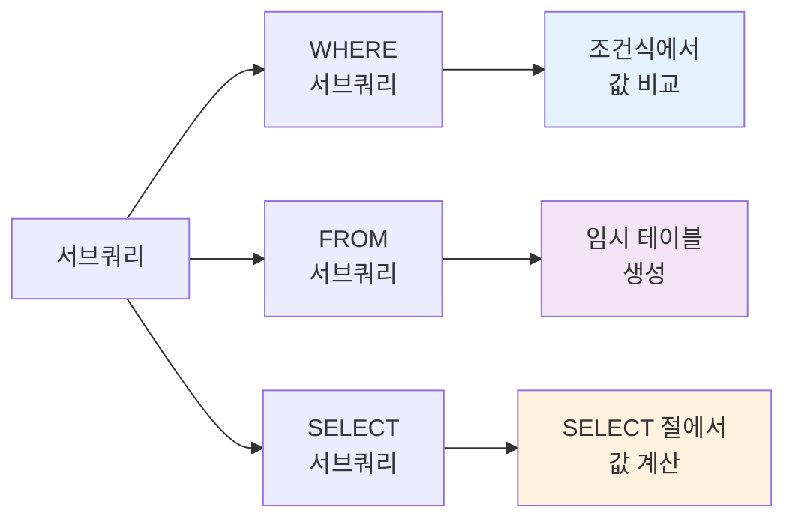

# 8장. 서브쿼리 (Subquery)

## 📖 수업 개요

이 장에서는 다른 쿼리 내에 포함된 쿼리인 서브쿼리(Subquery)를 학습합니다.
서브쿼리는 SQL의 강력한 도구로, 복잡한 데이터 검색 요구사항을 단계적으로 해결할 수 있게 합니다. 스칼라 서브쿼리, 인라인 뷰, 상관 서브쿼리, EXISTS 등 다양한 형태의 서브쿼리와 JOIN과의 성능 비교를 다룹니다.

---

## 📚 Part 1: 이론 학습

### 🌟 이 부분에서 배우는 것

- 서브쿼리의 개념과 분류
- 단일 행 서브쿼리와 다중 행 서브쿼리
- 스칼라 서브쿼리와 인라인 뷰
- 상관 서브쿼리의 개념과 활용
- EXISTS와 IN의 차이점
- 서브쿼리 성능 최적화

---

### 8.1 서브쿼리의 기본 개념

**서브쿼리**는 다른 쿼리 내에 포함된 SELECT 문입니다.

**특징:**

- 괄호 () 안에 작성
- 메인 쿼리보다 먼저 실행되는 경우가 많음 (내부 쿼리)
- 결과를 메인 쿼리가 사용

**사용 위치:**

```sql
SELECT ... (SELECT ... ) FROM ...    -- SELECT 절
FROM (SELECT ... ) AS alias_name     -- FROM 절
WHERE column IN (SELECT ... )        -- WHERE 절
```

---



---

### 8.2 단일 행 서브쿼리

**단일 행 서브쿼리**는 정확히 하나의 행을 반환하는 서브쿼리입니다.

**문법:**

```sql
SELECT * FROM employees
WHERE salary = (SELECT MAX(salary) FROM employees);
```

**특징:**

- 비교 연산자 사용 가능 (=, >, <, >=, <=, !=)
- 집계함수를 주로 포함
- 다중 행 서브쿼리보다 성능이 좋음

**예시:**

```sql
-- 평균 급여보다 높은 직원 찾기
SELECT * FROM employees
WHERE salary > (SELECT AVG(salary) FROM employees);

-- 특정 부서의 최대 급여와 같은 급여를 받는 직원
SELECT * FROM employees
WHERE salary = (SELECT MAX(salary) FROM employees WHERE dept_id = 1);
```

---

### 8.3 다중 행 서브쿼리

**다중 행 서브쿼리**는 하나 이상의 행을 반환하는 서브쿼리입니다.

**필요한 연산자:**

- IN: 서브쿼리 결과 중 하나와 일치
- NOT IN: 서브쿼리 결과 중 하나와도 일치하지 않음
- ANY: 서브쿼리 결과 중 하나와 비교 (=ANY는 IN과 같음)
- ALL: 서브쿼리 결과의 모든 값과 비교

**예시:**

```sql
-- 부서 1에 속한 직원의 급여와 같은 급여를 받는 모든 직원
SELECT * FROM employees
WHERE salary IN (SELECT salary FROM employees WHERE dept_id = 1);

-- 각 부서 평균 급여보다 높은 직원
SELECT * FROM employees
WHERE salary > ANY (SELECT AVG(salary) FROM employees GROUP BY dept_id);
```

---

### 8.4 스칼라 서브쿼리 (Scalar Subquery)

**스칼라 서브쿼리**는 SELECT 절에서 단일 값을 반환하는 서브쿼리입니다.

**문법:**

```sql
SELECT column, (SELECT ... FROM ...) AS alias
FROM table_name;
```

**특징:**

- 각 행마다 실행될 수 있음
- 상관 서브쿼리일 경우 성능이 저하될 수 있음
- JOIN으로 대체하면 성능 향상 가능

**예시:**

```sql
SELECT employee_id, name, 
       (SELECT department_name FROM departments d 
        WHERE d.dept_id = e.dept_id) AS dept_name
FROM employees e;
```

---

### 8.5 인라인 뷰 (Inline View)

**인라인 뷰**는 FROM 절에 사용되는 서브쿼리입니다.

**문법:**

```sql
SELECT * FROM (
  SELECT column FROM table_name WHERE condition
) AS alias_name;
```

**특징:**

- 임시 테이블처럼 동작
- 별칭 필수
- 복잡한 쿼리를 단계적으로 처리

**예시:**

```sql
-- 부서별 평균 급여를 구한 후, 평균 이상의 직원을 찾기
SELECT e.name, dept_avg.avg_salary
FROM employees e
JOIN (SELECT dept_id, AVG(salary) AS avg_salary 
      FROM employees GROUP BY dept_id) AS dept_avg
ON e.dept_id = dept_avg.dept_id
WHERE e.salary >= dept_avg.avg_salary;
```

---

### 8.6 상관 서브쿼리 (Correlated Subquery)

**상관 서브쿼리**는 외부 쿼리의 값을 참조하는 서브쿼리입니다.

**특징:**

- 외부 쿼리의 각 행에 대해 서브쿼리가 실행
- 성능이 저하될 수 있음
- 로직이 복잡할 수 있음

**예시:**

```sql
-- 각 직원의 급여가 같은 부서의 평균 급여보다 높은지 확인
SELECT name, salary
FROM employees e1
WHERE salary > (SELECT AVG(salary) FROM employees e2 
                WHERE e2.dept_id = e1.dept_id);
```

---

### 8.7 EXISTS와 NOT EXISTS

**EXISTS**는 서브쿼리가 행을 반환하는지 확인합니다.

**문법:**

```sql
SELECT * FROM table1
WHERE EXISTS (SELECT 1 FROM table2 WHERE condition);
```

**특징:**

- 실제 데이터보다 존재 여부만 확인
- IN보다 성능이 좋을 수 있음
- NULL 값 처리가 다름

**예시:**

```sql
-- 최소 하나의 주문이 있는 고객 찾기
SELECT * FROM customers c
WHERE EXISTS (SELECT 1 FROM orders o WHERE o.customer_id = c.customer_id);

-- 주문이 없는 고객 찾기
SELECT * FROM customers c
WHERE NOT EXISTS (SELECT 1 FROM orders o WHERE o.customer_id = c.customer_id);
```

---

### 8.8 서브쿼리 vs JOIN

동일한 결과를 서브쿼리와 JOIN으로 구현할 수 있습니다.

**서브쿼리:**

```sql
SELECT * FROM employees
WHERE dept_id IN (SELECT dept_id FROM departments WHERE location = '서울');
```

**JOIN:**

```sql
SELECT e.* FROM employees e
JOIN departments d ON e.dept_id = d.dept_id
WHERE d.location = '서울';
```

**성능 고려사항:**

- 일반적으로 JOIN이 더 빠름
- 서브쿼리가 명확한 경우 가독성 우선 고려
- 실제 성능은 쿼리 옵티마이저에 따라 다름

---

### 8.9 WITH (CTE: Common Table Expression)

**WITH**를 사용한 공통 테이블 표현식은 복잡한 쿼리를 가독성 있게 작성합니다.

**문법:**

```sql
WITH cte_name AS (
  SELECT column FROM table_name WHERE condition
)
SELECT * FROM cte_name;
```

**특징:**

- 임시 뷰처럼 동작
- 여러 번 참조 가능

---

## 📚 Part 2: 샘플 데이터

### 필수 테이블 구성

```sql
CREATE DATABASE ch8_subq CHARACTER SET utf8mb4;
USE ch8_subq;

-- employees 테이블
CREATE TABLE employees (
    employee_id INT PRIMARY KEY AUTO_INCREMENT,
    name VARCHAR(50),
    dept_id INT,
    salary DECIMAL(10, 2),
    hire_date DATE
);

INSERT INTO employees VALUES
(1, '김철수', 1, 5000000, '2020-01-15'),
(2, '이영희', 1, 4000000, '2020-06-20'),
(3, '박민준', 2, 4500000, '2019-03-10'),
(4, '최순신', 2, 3500000, '2021-07-15'),
(5, '강감찬', 3, 4200000, '2020-09-05');

-- departments 테이블
CREATE TABLE departments (
    dept_id INT PRIMARY KEY AUTO_INCREMENT,
    department_name VARCHAR(50),
    location VARCHAR(50)
);

INSERT INTO departments VALUES
(1, '영업부', '서울'),
(2, '기술부', '대전'),
(3, '인사부', '서울'),
(4, '재무부', '부산');

-- customers 테이블
CREATE TABLE customers (
    customer_id INT PRIMARY KEY AUTO_INCREMENT,
    name VARCHAR(50)
);

-- orders 테이블
CREATE TABLE orders (
    order_id INT PRIMARY KEY AUTO_INCREMENT,
    customer_id INT,
    order_date DATE,
    total_amount DECIMAL(10, 2)
);
```

---

## 💻 Part 3: 실습 (20개 문제)

### 이 부분에서 배우는 것

이 섹션에서는 배운 서브쿼리의 다양한 형태를 실제로 작성하고 실행합니다.
기본 단일 행 서브쿼리부터 시작하여, 다중 행 서브쿼리, 스칼라 서브쿼리, 상관 서브쿼리, EXISTS, WITH (CTE)까지 실무에서 필요한 서브쿼리 능력을 기르게 됩니다.

```sql
-- =====================================================
-- 8-1~8-6: 단일 행 및 다중 행 서브쿼리
-- =====================================================

-- 1. 단일 행 서브쿼리 - 최대값 (최고 급여 직원)
SELECT * FROM employees
WHERE salary = (SELECT MAX(salary) FROM employees);

-- 2. 단일 행 서브쿼리 - 평균값 (평균 급여보다 높은 직원)
SELECT name, salary FROM employees
WHERE salary > (SELECT AVG(salary) FROM employees);

-- 3. 단일 행 서브쿼리 - 특정 부서 (부서 1 최대 급여)
SELECT * FROM employees
WHERE salary = (SELECT MAX(salary) FROM employees WHERE dept_id = 1);

-- 4. 다중 행 서브쿼리 - IN (부서 1,2의 급여와 같은 직원)
SELECT * FROM employees
WHERE salary IN (SELECT salary FROM employees WHERE dept_id IN (1, 2));

-- 5. 다중 행 서브쿼리 - NOT IN (부서 1의 급여와 다른 직원)
SELECT * FROM employees
WHERE salary NOT IN (SELECT salary FROM employees WHERE dept_id = 1);

-- 6. 다중 행 서브쿼리 - ANY (각 부서 평균보다 높은 급여)
SELECT name, salary, dept_id FROM employees
WHERE salary > ANY (SELECT AVG(salary) FROM employees GROUP BY dept_id);

-- =====================================================
-- 8-7~8-10: 스칼라 서브쿼리와 인라인 뷰
-- =====================================================

-- 7. 스칼라 서브쿼리 (각 직원의 부서 평균 급여)
SELECT name, salary,
       (SELECT AVG(salary) FROM employees e2 WHERE e2.dept_id = e1.dept_id) AS dept_avg
FROM employees e1;

-- 8. 스칼라 서브쿼리 - 부서명 조회 (부서명 추가)
SELECT name,
       (SELECT department_name FROM departments WHERE dept_id = e.dept_id) AS dept_name
FROM employees e;

-- 9. 인라인 뷰 - 기본 (부서별 평균 급여, 4000000 이상)
SELECT dept_id, dept_avg FROM (
    SELECT dept_id, AVG(salary) AS dept_avg
    FROM employees
    GROUP BY dept_id
) AS dept_salary
WHERE dept_avg > 4000000;

-- 10. 인라인 뷰 - 정렬 및 필터링 (급여 높은 순, 4000000 이상)
SELECT * FROM (
    SELECT name, salary FROM employees ORDER BY salary DESC
) AS sorted_emp
WHERE salary > 4000000;

-- =====================================================
-- 8-11~8-14: 상관 서브쿼리와 EXISTS
-- =====================================================

-- 11. 상관 서브쿼리 - 비교 (부서 평균과 비교)
SELECT name, salary,
       CASE WHEN salary > (SELECT AVG(salary) FROM employees e2 WHERE e2.dept_id = e1.dept_id)
            THEN '평균 이상' ELSE '평균 미만' END AS salary_level
FROM employees e1;

-- 12. 상관 서브쿼리 - COUNT (같은 부서 직원 수)
SELECT name,
       (SELECT COUNT(*) FROM employees e2 WHERE e2.dept_id = e1.dept_id) AS dept_count
FROM employees e1;

-- 13. EXISTS 기본 (주문이 있는 고객)
SELECT customer_id FROM customers c
WHERE EXISTS (SELECT 1 FROM orders o WHERE o.customer_id = c.customer_id);

-- 14. NOT EXISTS (주문이 없는 고객)
SELECT customer_id FROM customers c
WHERE NOT EXISTS (SELECT 1 FROM orders o WHERE o.customer_id = c.customer_id);

-- =====================================================
-- 8-15~8-20: 중첩, 비교 및 고급 서브쿼리
-- =====================================================

-- 15. 서브쿼리 vs JOIN (서울 부서 직원)
SELECT name FROM employees
WHERE dept_id IN (SELECT dept_id FROM departments WHERE location = '서울');

-- 16. 중첩 서브쿼리 (서울 부서 평균보다 높은 급여)
SELECT name FROM employees
WHERE salary > (SELECT AVG(salary) FROM employees
                WHERE dept_id IN (SELECT dept_id FROM departments WHERE location = '서울'));

-- 17. 집계함수와 서브쿼리 (통계 조회)
SELECT (SELECT COUNT(*) FROM employees) AS total_emp,
       (SELECT AVG(salary) FROM employees) AS avg_salary,
       (SELECT MAX(salary) FROM employees) AS max_salary;

-- 18. 서브쿼리 - 동적 WHERE (김철수와 같은 부서)
SELECT * FROM employees
WHERE dept_id = (SELECT dept_id FROM employees WHERE name = '김철수');

-- 19. WITH (CTE) - 부서별 평균
WITH dept_avg AS (
    SELECT dept_id, AVG(salary) AS avg_salary FROM employees GROUP BY dept_id
)
SELECT e.name, e.salary, d.avg_salary
FROM employees e
JOIN dept_avg d ON e.dept_id = d.dept_id;

-- 20. 서브쿼리 - 순위 매기기 (행별 순위 계산)
SELECT name, salary,
       (SELECT COUNT(*) FROM employees e2 WHERE e2.salary > e1.salary) + 1 AS ranking
FROM employees e1;
```

---

## 📝 Part 4: 과제 안내

### 이론 과제

**1번 과제**: 단일 행 서브쿼리, 다중 행 서브쿼리, 스칼라 서브쿼리의 특징과 사용 시기를 설명하세요. 각각의 실무 활용 사례를 3가지 이상 제시하세요.

**2번 과제**: 상관 서브쿼리의 개념을 설명하고, 실행 방식의 차이점을 설명하세요. 성능 문제가 발생할 수 있는 상황과 해결 방법을 논의하세요.

**3번 과제**: EXISTS와 IN의 차이점을 설명하세요. 각각의 성능 특성과 NULL 값 처리 방식의 차이를 분석하여 선택 기준을 제시하세요.

**4번 과제**: 서브쿼리와 JOIN으로 같은 결과를 얻을 수 있습니다. 각각의 장단점을 비교하고, 성능 측면에서 어떤 경우 어느 것을 선택해야 하는지 설명하세요.

**5번 과제**: WITH (CTE)와 서브쿼리의 차이점을 설명하세요. 재귀 CTE의 개념과 활용 사례를 제시하고, 복잡한 계층 구조 데이터를 처리하는 방법을 서술하세요.

제출 형식: Word 또는 PDF 문서 (2-3페이지)

---

### 실습 과제

**1번 과제**: 다양한 형태의 서브쿼리를 작성하세요:

- 단일 행 서브쿼리로 특정 값과 같은 데이터 조회
- 다중 행 서브쿼리로 여러 값 중 하나와 일치하는 데이터 조회
- 스칼라 서브쿼리로 각 행에 함께 표시할 정보 조회

**2번 과제**: 상관 서브쿼리를 작성하세요:

- 각 그룹의 평균과 비교하는 상관 서브쿼리
- 같은 그룹 내 다른 행과 비교하는 상관 서브쿼리
- 복수 조건의 상관 서브쿼리

**3번 과제**: EXISTS와 NOT EXISTS를 사용하세요:

- 특정 조건을 만족하는 데이터가 존재하는지 확인
- 특정 조건을 만족하는 데이터가 없는 것을 조회
- NOT EXISTS를 사용한 안티조인(Anti-join)

**4번 과제**: 서브쿼리와 JOIN으로 같은 결과를 얻고 성능을 비교하세요:

- 서브쿼리와 JOIN으로 같은 쿼리를 작성
- EXPLAIN 명령어로 실행 계획 비교
- 성능 차이를 분석하고 선택 이유를 설명

**5번 과제**: Part 3의 실습 8-1부터 8-20까지 제공된 모든 쿼리를 직접 실행하고, 각 쿼리의 결과를 스크린샷으로 첨부하세요. 추가로 5개 이상의 창의적인 서브쿼리를 작성하여 그 결과를 제시하고, 각 쿼리의 목적과 실무 활용 방법을 설명하세요.

제출 형식: SQL 파일 (Ch8_Subquery_[학번].sql) 및 결과 스크린샷

---

수고했습니다.   
조정현 교수([peterchokr@gmail.com](mailto:peterchokr@gmail.com)) 영남이공대학교

이 수업자료는 Claude와 Gemini를 이용하여 제작되었습니다.
