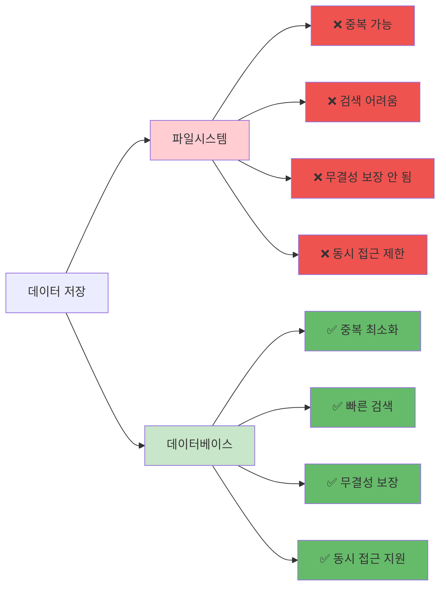
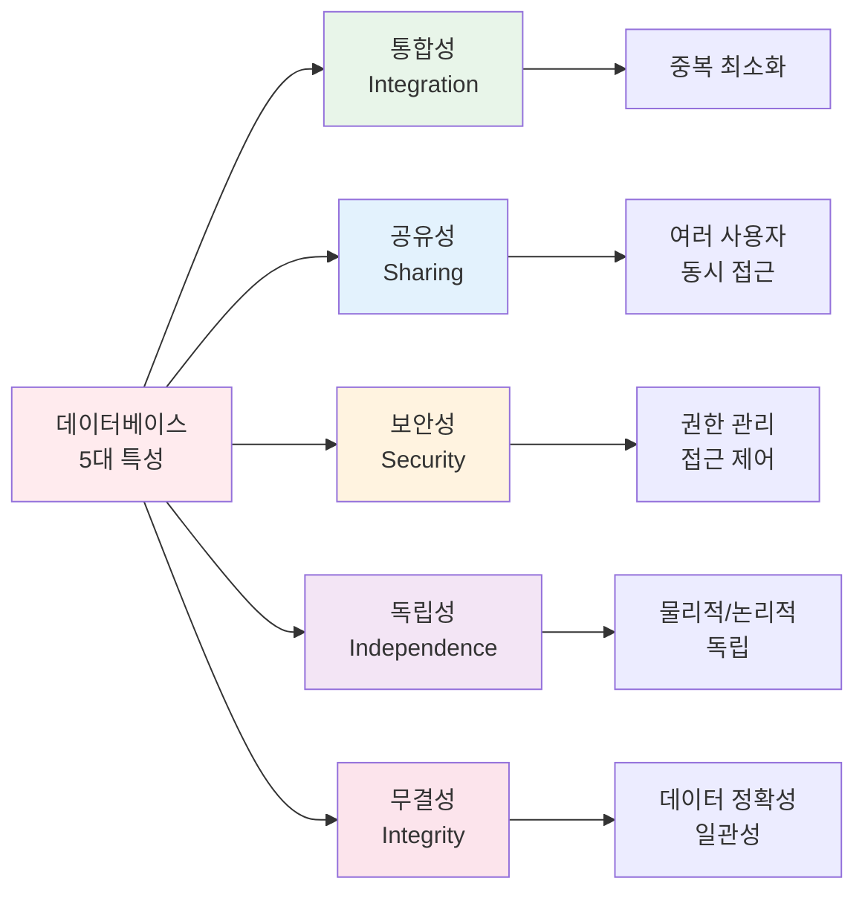
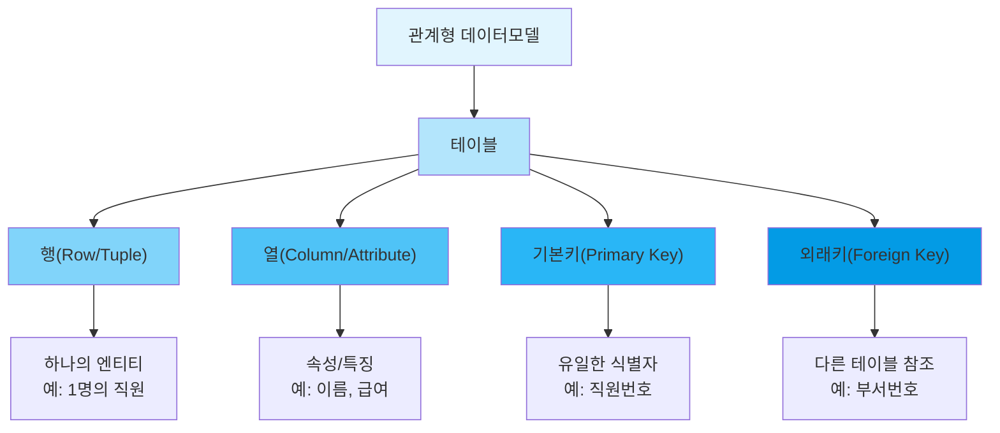

# 1장. 데이터베이스 개요 및 학습 환경 구축

---

## 📋 수업 개요

**수업 주제**: 데이터베이스의 개념 이해 및 MySQL 환경 구축

**수업 목표**

- 데이터베이스와 파일 시스템의 차이 이해
- 관계형 데이터베이스의 기본 개념 습득
- MySQL 설치 및 기본 환경 구축
- 데이터베이스의 실제 활용 사례 이해

**준비물**

- Windows/Mac/Linux 운영체제
- MySQL 설치 파일
- MySQL Workbench
- 인터넷 연결

---

## 📚 Part 1: 이론 학습

### 이 부분에서 배우는 것

이 섹션에서는 데이터베이스의 가장 기본적인 개념부터 시작합니다.
데이터, 정보, 데이터베이스의 차이를 명확히 이해하고, 파일 시스템과 데이터베이스의 차이점을 학습합니다.
또한 관계형 데이터베이스의 구조와 MySQL의 특징, 그리고 DBMS의 역할을 이해함으로써 이후 실습을 위한 이론적 기초를 다집니다.

### 1-1. 데이터베이스의 개념

#### **데이터 vs 정보 vs 데이터베이스**

```
데이터 (Data)
├─ 정의: 현실 세계로부터 수집한 사실이나 수치
├─ 예시: 학번 202401001, 이름 "김철수", 학점 3.8
└─ 특징: 단순한 사실, 의미 없음

정보 (Information)
├─ 정의: 데이터를 처리하여 의미를 부여한 것
├─ 예시: "AI소프트웨어학과 학생 중 학점 3.8 이상이 5명"
└─ 특징: 의미 있음, 의사결정 도구

데이터베이스 (Database, DB)
├─ 정의: 특정 조직의 여러 사용자가 공유하고 
│        운영할 수 있도록 저장된 데이터의 집합
├─ 특징: 통합, 저장, 공유, 운영 가능
└─ 목적: 정보 생성, 의사결정 지원
```

#### **파일 시스템 vs 데이터베이스**

| 항목                | 파일 시스템   | 데이터베이스  |
| ------------------- | ------------- | ------------- |
| **저장 방식** | 개별 파일     | 통합된 데이터 |
| **중복**      | 많음          | 최소화        |
| **접근 방식** | 프로그램 의존 | 독립적 접근   |
| **보안**      | 낮음          | 높음          |
| **효율성**    | 낮음          | 높음          |
| **동시 접근** | 어려움        | 용이          |
| **예시**      | Excel, CSV    | MySQL, Oracle |

**예시 비교**

파일 시스템에서의 학생 정보 관리:

- 학생_기본정보.csv
- 학생_성적.csv
- 학생_출석.csv
  → 중복 가능, 일관성 문제 발생

데이터베이스에서의 학생 정보 관리:

- student 테이블
  - student_id (학번)
  - name (이름)
  - gpa (학점)
  - attendance (출석)
    → 통합 관리, 중복 제거




### 1-2. 데이터베이스의 장점

#### **데이터베이스 도입 효과**

```
장점 1: 데이터 무결성
├─ 제약조건으로 잘못된 데이터 입력 방지
├─ 데이터 일관성 유지
└─ 예: 학점은 0~4.5 범위만 허용

장점 2: 보안성 향상
├─ 사용자 권한 관리
├─ 암호화 지원
└─ 접근 제어

장점 3: 데이터 공유
├─ 여러 사용자 동시 접근
├─ 네트워크를 통한 원격 접근
└─ 협업 효율 증대

장점 4: 성능 최적화
├─ 인덱스를 통한 검색 속도 향상
├─ 쿼리 최적화
└─ 대용량 데이터 처리

장점 5: 복구 가능성
├─ 백업 및 복구 기능
├─ 트랜잭션 처리
└─ 장애 복구
```




---

### 1-3. 관계형 데이터베이스(RDBMS)의 개념

#### **RDBMS란?**

```
RDBMS (Relational Database Management System)
= 관계형 데이터베이스 관리 시스템

특징:
1. 행(Row)과 열(Column)로 구성된 테이블
2. 테이블 간 관계(Relationship) 설정
3. SQL 문으로 데이터 조작
4. 데이터 무결성 보장
5. 트랜잭션 처리 지원
```

#### **기본 용어**

```
테이블 (Table)
├─ 정의: 행과 열로 구성된 데이터 집합
└─ 예: student (학생 정보 테이블)

행 (Row) = 레코드 (Record)
├─ 정의: 테이블의 한 줄
└─ 예: 202401001, 김철수, AI소프트웨어학과

열 (Column) = 속성 (Attribute)
├─ 정의: 테이블의 한 항목
└─ 예: student_id, name, department

기본키 (Primary Key)
├─ 정의: 각 행을 유일하게 식별하는 열
└─ 예: student_id (중복 불가, NULL 불가)

외래키 (Foreign Key)
├─ 정의: 다른 테이블의 기본키를 참조
└─ 예: course 테이블의 professor_id
```



---

### 1-4. MySQL 소개

#### **MySQL이란?**

```
MySQL (My Structured Query Language)

특징:
1. 오픈소스 데이터베이스
2. 무료 (상용 지원 유료)
3. 높은 성능과 안정성
4. 웹 애플리케이션에 많이 사용
5. LAMP/LEMP 스택의 핵심

버전:
- MySQL 5.7 (이전 버전)
- MySQL 8.0 (현재 표준)
- MariaDB (MySQL 호환 오픈소스)

선택 이유:
✓ 배우기 쉬움
✓ 설치가 간단
✓ 커뮤니티가 활발
✓ 산업 표준
✓ 한국에서도 많이 사용
```

#### **다른 RDBMS와의 비교**

| 특성                  | MySQL          | Oracle       | SQL Server   | PostgreSQL |
| --------------------- | -------------- | ------------ | ------------ | ---------- |
| **가격**        | 무료           | 매우 비쌈    | 비쌈         | 무료       |
| **배우기**      | 쉬움           | 어려움       | 중간         | 중간       |
| **웹 용도**     | 매우 좋음      | 엔터프라이즈 | 엔터프라이즈 | 좋음       |
| **한국 점유율** | 높음           | 높음         | 중간         | 낮음       |
| **추천 대상**   | 초보자, 웹개발 | 대기업       | 대기업       | 개발자     |

---

### 1-5. 데이터베이스 관리 시스템의 역할

```
DBMS의 역할

1. 데이터 정의 (Data Definition)
   └─ DDL: CREATE, ALTER, DROP

2. 데이터 조작 (Data Manipulation)
   └─ DML: SELECT, INSERT, UPDATE, DELETE

3. 데이터 제어 (Data Control)
   └─ DCL: GRANT, REVOKE

4. 데이터 무결성 관리
   └─ 제약조건, 트리거

5. 동시성 제어
   └─ 여러 사용자 동시 접근 관리

6. 백업 및 복구
   └─ 장애 대비
```

---

## 📚 Part 2: MySQL 설치 및 환경 구축

### 이 부분에서 배우는 것

이 섹션에서는 실제로 MySQL을 설치하고 기본 환경을 구성하는 방법을 배웁니다.
Windows 운영체제에서의 설치 절차를 단계별로 따라가며, MySQL Workbench를 실행하여 정상적으로 작동하는지 확인합니다. 이론에서 배운 개념을 실제 환경에서 적용해보는 실습입니다.

### 2-1. MySQL 설치 (Windows 예시)

1단계: MySQL 다운로드

- https://dev.mysql.com/downloads/mysql/ 접속
- MySQL 8.0 버전 선택
- Windows 버전 다운로드

2단계: 설치 프로그램 실행

- mysql-8.0.x-winx64.msi 실행
- Setup Type: Developer Default 선택
- MySQL Server, MySQL Workbench 포함 확인

3단계: 설정

- Port: 3306 (기본값)
- Configuration Type: Development Machine
- Authentication Method: MySQL 8.0 compatible

4단계: 초기 설정

- Root 사용자 비밀번호 설정
- 기본 포트 3306 확인
- Windows Service로 등록

5단계: 완료

- MySQL 서버 자동 시작 설정
- MySQL Workbench 설치 확인

### 2-2. MySQL Workbench 첫 실행

1. MySQL Workbench 실행
2. Local instance MySQL 클릭
3. 비밀번호 입력
4. 연결 성공 확인

---

## 💻 Part 3: 실습

### 이 부분에서 배우는 것

이 섹션에서는 MySQL 설치가 성공적으로 이루어졌는지 확인하고, 데이터베이스와 테이블의 기본 구조를 직접 만들어봅니다. SQL 명령어를 입력하여 설정을 확인하고, 실제로 데이터를 저장하고 조회하는 기초 경험을 얻게 됩니다.

### 3-1. 개념 확인 실습

**실습 1-1: MySQL 설치 확인**

```sql
-- MySQL 버전 확인
SELECT VERSION();

-- 현재 데이터베이스 확인
SELECT DATABASE();

-- 현재 사용자 확인
SELECT USER();

-- MySQL 상태 확인
SHOW STATUS;
```

**실습 1-2: 기본 시스템 정보**

```sql
-- 모든 데이터베이스 목록
SHOW DATABASES;

-- MySQL 포트 확인
SHOW VARIABLES LIKE 'port';

-- 문자셋 확인
SHOW VARIABLES LIKE 'character_set%';
```

---

### 3-2. 기본 데이터베이스 및 테이블 생성 실습

**실습 1-3: 데이터베이스 생성**

```sql
-- 데이터베이스 생성
CREATE DATABASE ch1_practice CHARACTER SET utf8mb4;

-- 데이터베이스 선택
USE ch1_practice;

-- 생성된 데이터베이스 확인
SHOW DATABASES;

-- 현재 데이터베이스 확인
SELECT DATABASE();
```

**실습 1-4: 기본 테이블 생성**

```sql
-- 학생 테이블 생성
CREATE TABLE student (
    student_id INT PRIMARY KEY,
    name VARCHAR(30) NOT NULL,
    department VARCHAR(30),
    gpa DECIMAL(3, 2)
) CHARACTER SET utf8mb4;

-- 테이블 구조 확인
DESC student;
SHOW CREATE TABLE student;

-- 모든 테이블 확인
SHOW TABLES;
```

**실습 1-5: 샘플 데이터 입력**

```sql
-- 데이터 입력
INSERT INTO student VALUES
(202401001, '김철수', 'AI소프트웨어학과', 3.85),
(202401002, '이영희', 'AI소프트웨어학과', 3.92),
(202401003, '박보영', 'AI소프트웨어학과', 3.45);

-- 데이터 확인
SELECT * FROM student;
```

---

### 3-3. 통합 실습

**실습 1-6: 완전한 설정 확인**

```sql
-- 1. 현재 상태 확인
SELECT '=== MySQL 연결 상태 ===' AS info;
SELECT VERSION() AS MySQL_버전;
SELECT USER() AS 현재사용자;
SELECT DATABASE() AS 현재데이터베이스;

-- 2. 테이블 상태 확인
SELECT '=== 테이블 정보 ===' AS info;
SHOW TABLES;
DESC student;

-- 3. 데이터 확인
SELECT '=== 저장된 데이터 ===' AS info;
SELECT COUNT(*) AS 총학생수 FROM student;
SELECT AVG(gpa) AS 평균학점 FROM student;
```

---

## 📝 Part 4: 과제 안내

### 이론 과제

**1번 과제**: 데이터와 정보의 관계를 설명하고, 일상 생활에서 이를 적용한 사례를 들어주세요. 예를 들어, 수강 신청 시스템에서 수집되는 데이터가 어떻게 정보로 변환되는지 설명하면 좋습니다.

**2번 과제**: 파일 시스템을 이용하여 학생 정보를 관리하는 경우의 문제점을 설명하고, 데이터베이스를 사용했을 때의 개선 사항을 비교 분석하세요.

**3번 과제**: 관계형 데이터베이스의 특징과 MySQL이 관계형 데이터베이스의 대표적인 예시인 이유를 설명하세요.

**4번 과제**: DBMS의 주요 역할 여섯 가지를 설명하고, 각각의 역할이 실제 업무에서 어떻게 중요한지 서술하세요.

**5번 과제**: 데이터베이스를 도입했을 때의 다섯 가지 주요 장점을 설명하고, 각 장점이 조직의 경쟁력에 어떤 영향을 미치는지 논의하세요.

제출 형식: Word 또는 PDF 문서 (1-2페이지)

---

### 실습 과제

**1번 과제**: MySQL이 정상적으로 설치되었는지 확인하기 위해 SELECT VERSION(), SELECT USER(), SELECT DATABASE() 등의 기본 명령어를 실행하고, 그 결과를 스크린샷으로 첨부하여 설치 완료를 증명하세요.

**2번 과제**: 'ch1_mydata'라는 이름의 새로운 데이터베이스를 생성하고, 그 데이터베이스가 제대로 생성되었는지 SHOW DATABASES 명령어로 확인한 후 결과 스크린샷을 첨부하세요.

**3번 과제**: ch1_mydata 데이터베이스 내에 product라는 이름의 테이블을 다음 열들로 생성하세요. 열은 product_id (정수형, 기본키), product_name (가변 문자형 50자), price (정수형), stock (정수형)으로 구성되어야 합니다. 생성 후 테이블이 제대로 만들어졌는지 확인하세요.

**4번 과제**: product 테이블의 구조를 DESC 명령어로 조회하여 설계한 대로 모든 열이 올바르게 생성되었는지 확인하고, 그 결과를 스크린샷으로 제출하세요.

**5번 과제**: product 테이블에 최소 3개 이상의 상품 데이터를 입력하세요. 각 상품은 실제 존재하는 상품이어야 하며, 가격과 재고량은 현실적인 수치여야 합니다. 데이터를 입력한 후 SELECT 문으로 모든 데이터를 조회하여 제대로 저장되었는지 확인하고 결과를 스크린샷으로 첨부하세요.

제출 형식: SQL 파일 (Ch1_Practice_[학번].sql) 및 스크린샷 모음

---

수고했습니다.
조정현 교수([peterchokr@gmail.com](mailto:peterchokr@gmail.com)) 영남이공대학교

이 수업자료는 Claude와 Gemini를 이용하여 제작되었습니다.
