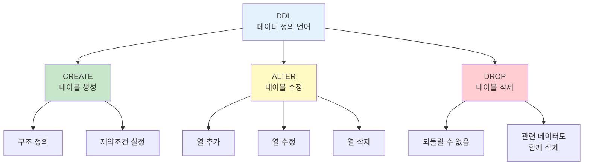

# 2장. 데이터베이스 및 테이블 설계

---

## 📋 수업 개요

**수업 주제**: DDL(CREATE, ALTER, DROP)을 이용한 테이블 설계

**수업 목표**

- CREATE TABLE 문법 완벽 숙달
- 데이터타입 및 제약조건 이해
- ALTER TABLE로 테이블 수정
- 효율적인 데이터베이스 설계

---

## 📚 Part 1: 이론 학습

### 이 부분에서 배우는 것

이 섹션에서는 데이터베이스 설계의 핵심인 데이터타입과 제약조건의 개념을 학습합니다.    
각 데이터타입이 언제 사용되는지, 그리고 제약조건이 데이터 무결성을 어떻게 보장하는지를 이해합니다.    
또한 CREATE TABLE, ALTER TABLE 등의 DDL 명령어를 익혀 실제로 테이블을 설계하고 수정하는 방법을 배웁니다.





### 2-1. 데이터타입 이해

#### **주요 데이터타입**

```
숫자형:
├─ INT: 정수 (-2,147,483,648 ~ 2,147,483,647)
├─ DECIMAL(5,2): 부동소수점 (3자리.2자리, 금액에 적합)
├─ FLOAT, DOUBLE: 부동소수점 (성능용)
└─ BIGINT: 큰 정수

문자형:
├─ VARCHAR(n): 가변길이 문자 (0~255자, 권장)
├─ CHAR(n): 고정길이 문자 (낭비 가능)
├─ TEXT: 긴 텍스트
└─ ENUM: 정해진 값만 (남/여)

날짜/시간:
├─ DATE: 2024-01-15
├─ TIME: 14:30:45
├─ DATETIME: 2024-01-15 14:30:45
└─ TIMESTAMP: 자동 기록

기타:
├─ BOOLEAN: TRUE/FALSE
└─ BLOB: 이진 데이터 (사진, 파일)
```

### 2-2. 제약조건(Constraints)

```
PRIMARY KEY
├─ 각 행을 유일하게 식별
├─ 중복 불가, NULL 불가
└─ CREATE TABLE에서 설정

NOT NULL
├─ 반드시 값이 있어야 함
└─ 예: 이름, 학번

UNIQUE
├─ 중복 불가 (NULL은 허용)
└─ 예: 이메일, 주민등록번호

DEFAULT
├─ 입력하지 않으면 기본값 사용
└─ 예: 가입일자 = CURDATE()

CHECK
├─ 조건을 만족하는 값만 허용
└─ 예: 나이 >= 0

FOREIGN KEY
├─ 다른 테이블의 기본키 참조
└─ 참조 무결성 유지
```

### 2-3. CREATE TABLE 문법

```sql
CREATE TABLE 테이블명 (
    열이름1 데이터타입 [제약조건],
    열이름2 데이터타입 [제약조건],
    PRIMARY KEY (열이름)
) CHARACTER SET utf8mb4;

실제 예시:
CREATE TABLE employee (
    emp_id INT PRIMARY KEY AUTO_INCREMENT,
    emp_name VARCHAR(30) NOT NULL,
    department VARCHAR(20),
    salary DECIMAL(10,2),
    hire_date DATE DEFAULT (CURDATE()),
    CHECK (salary > 0)
) CHARACTER SET utf8mb4;
```

### 2-4. ALTER TABLE 문법

```sql
-- 열 추가
ALTER TABLE 테이블명 
ADD 열이름 데이터타입;

-- 열 삭제
ALTER TABLE 테이블명 
DROP COLUMN 열이름;

-- 열 수정
ALTER TABLE 테이블명 
MODIFY 열이름 새로운데이터타입;

-- 열 이름 변경
ALTER TABLE 테이블명 
CHANGE 기존이름 새로운이름 데이터타입;
```

---

## 📚 Part 2: 샘플 테이블 설계

### 이 부분에서 배우는 것

이 섹션에서는 배운 데이터타입과 제약조건을 실제로 적용하여 테이블을 설계합니다.    
department 테이블과 employee 테이블의 예시를 통해 테이블 간 관계를 설정하고, 외래키를 정의하는 방법을 배웁니다.    
또한 샘플 데이터를 삽입하여 설계한 테이블이 제대로 작동하는지 확인합니다.

### 2-1. 데이터베이스 및 테이블 생성

```sql
-- 데이터베이스 생성
CREATE DATABASE ch2_design CHARACTER SET utf8mb4;
USE ch2_design;

-- 부서 테이블
CREATE TABLE department (
    dept_id INT PRIMARY KEY AUTO_INCREMENT,
    dept_name VARCHAR(30) NOT NULL UNIQUE,
    location VARCHAR(30),
    budget DECIMAL(15,2),
    CONSTRAINT check_budget CHECK (budget >= 0)
) CHARACTER SET utf8mb4;

-- 직원 테이블
CREATE TABLE employee (
    emp_id INT PRIMARY KEY AUTO_INCREMENT,
    emp_name VARCHAR(30) NOT NULL,
    dept_id INT,
    position VARCHAR(20),
    salary DECIMAL(10,2),
    hire_date DATE DEFAULT (CURDATE()),
    phone VARCHAR(15),
    FOREIGN KEY (dept_id) REFERENCES department(dept_id),
    CONSTRAINT check_salary CHECK (salary > 0)
) CHARACTER SET utf8mb4;

-- 샘플 데이터
INSERT INTO department VALUES
(1, '영업팀', '서울', 100000000),
(2, '개발팀', '판교', 150000000),
(3, '인사팀', '서울', 50000000);

INSERT INTO employee VALUES
(1, '김철수', 1, '팀장', 5000000, '2020-01-15', '010-1111-1111'),
(2, '이영희', 2, '개발자', 4000000, '2021-03-20', '010-2222-2222'),
(3, '박보영', 2, '개발자', 3500000, '2022-06-10', '010-3333-3333');
```

---

## 💻 Part 3: 실습

### 이 부분에서 배우는 것

이 섹션에서는 배운 DDL 명령어를 직접 실행하여 테이블을 만들고 수정해봅니다.    
CREATE TABLE을 사용하여 다양한 데이터타입과 제약조건을 적용하고, ALTER TABLE로 테이블 구조를 변경하는 실습을 하게 됩니다. 이를 통해 실제 데이터베이스 설계 능력을 기르게 됩니다.

### 3-1. 기본 테이블 생성 실습

**실습 3-1: 간단한 테이블 생성**

```sql
-- 고객 테이블
CREATE TABLE customer (
    customer_id INT PRIMARY KEY AUTO_INCREMENT,
    customer_name VARCHAR(30) NOT NULL,
    email VARCHAR(50) UNIQUE,
    phone VARCHAR(15),
    signup_date DATE DEFAULT (CURDATE())
) CHARACTER SET utf8mb4;

-- 확인
DESC customer;
SHOW CREATE TABLE customer;
```

**실습 3-2: 제약조건이 있는 테이블**

```sql
-- 상품 테이블
CREATE TABLE product (
    product_id INT PRIMARY KEY AUTO_INCREMENT,
    product_name VARCHAR(50) NOT NULL,
    category VARCHAR(20),
    price INT,
    stock INT DEFAULT 0,
    CHECK (price > 0),
    CHECK (stock >= 0)
) CHARACTER SET utf8mb4;

-- 데이터 입력
INSERT INTO product VALUES
(NULL, '노트북', '전자제품', 1500000, 10),
(NULL, '마우스', '전자제품', 50000, 50),
(NULL, '책상', '가구', 300000, 5);
```

---

### 3-2. 테이블 수정 실습

**실습 3-3: ALTER TABLE 연습**

```sql
-- 고객 테이블에 열 추가
ALTER TABLE customer 
ADD address VARCHAR(100);

ALTER TABLE customer 
ADD grade VARCHAR(10) DEFAULT 'Silver';

-- 확인
DESC customer;

-- 열 수정
ALTER TABLE customer 
MODIFY phone VARCHAR(20);

-- 열 삭제
ALTER TABLE customer 
DROP COLUMN grade;
```

---

### 3-3. 통합 설계 실습

**실습 3-4: 완전한 데이터베이스 설계**

```sql
-- 주문 시스템 설계

CREATE TABLE orders (
    order_id INT PRIMARY KEY AUTO_INCREMENT,
    customer_id INT NOT NULL,
    order_date DATETIME DEFAULT CURRENT_TIMESTAMP,
    total_amount DECIMAL(12,2),
    status VARCHAR(20) DEFAULT '주문접수',
    FOREIGN KEY (customer_id) REFERENCES customer(customer_id),
    CHECK (total_amount > 0)
) CHARACTER SET utf8mb4;

CREATE TABLE order_detail (
    order_detail_id INT PRIMARY KEY AUTO_INCREMENT,
    order_id INT NOT NULL,
    product_id INT NOT NULL,
    quantity INT NOT NULL,
    price DECIMAL(10,2),
    FOREIGN KEY (order_id) REFERENCES orders(order_id),
    FOREIGN KEY (product_id) REFERENCES product(product_id),
    CHECK (quantity > 0)
) CHARACTER SET utf8mb4;

-- 테이블 구조 확인
SHOW TABLES;
DESC orders;
DESC order_detail;
```

---

## 📝 Part 4: 과제 안내

### 이론 과제

**1번 과제**: VARCHAR(30)과 CHAR(30) 데이터타입의 차이점을 설명하고, 각각이 적절하게 사용되는 사례를 두 가지씩 제시하세요. 저장 공간 효율성 관점에서도 논의하세요.

**2번 과제**: 금액을 저장할 때 DECIMAL(10,2)과 FLOAT 데이터타입 중 어느 것을 선택해야 하는지 설명하고, 각 데이터타입의 장단점을 비교 분석하세요.

**3번 과제**: PRIMARY KEY와 UNIQUE 제약조건의 차이를 설명하고, 테이블 설계 시 이 두 제약조건을 어떻게 구분하여 적용해야 하는지 실무 사례를 들어 서술하세요.

**4번 과제**: NOT NULL 제약조건과 UNIQUE 제약조건을 함께 적용했을 때와 따로 적용했을 때의 차이점을 설명하고, 각각이 데이터 무결성에 미치는 영향을 논의하세요.

**5번 과제**: 외래키(FOREIGN KEY)의 역할과 중요성을 설명하고, 외래키를 사용하지 않았을 때 발생 가능한 데이터 일관성 문제를 사례를 들어 설명하세요.

제출 형식: Word 또는 PDF 문서 (1-2페이지)

---

### 실습 과제

**1번 과제**: 다음의 요구사항을 만족하는 professor 테이블을 설계하여 CREATE TABLE 문을 작성하세요. 테이블은 교수번호(정수형, 기본키, 자동증가), 교수명(가변 문자형 30자, 필수), 학과(가변 문자형 20자), 직급(가변 문자형 20자), 급여(십진수 10자리 2소수자리, 0 이상만 허용)로 구성되어야 합니다.

**2번 과제**: professor 테이블에 5명 이상의 교수 데이터를 현실적인 정보로 입력하세요. 각 교수는 실제 대학교의 교수처럼 다양한 학과와 직급을 가져야 합니다.

**3번 과제**: ALTER TABLE 문을 사용하여 professor 테이블에 phone이라는 새로운 열을 추가하세요. 이 열은 교수의 휴대폰 번호를 저장하기 위한 가변 문자형이어야 합니다. 추가 후 DESC 명령어로 테이블 구조를 확인해 변경사항을 스크린샷으로 첨부하세요.

**4번 과제**: professor 테이블의 salary 열을 DECIMAL(12,2)로 수정하여 더 큰 금액을 저장할 수 있도록 변경하세요. ALTER TABLE의 MODIFY 명령어를 사용하여 수정한 후 수정이 제대로 적용되었는지 DESCRIBE 또는 SHOW CREATE TABLE로 확인하고 결과를 스크린샷으로 제출하세요.

**5번 과제**: 지금까지 생성한 professor 테이블의 전체 구조를 DESC 명령어로 조회하여 모든 설계 요구사항이 정확하게 반영되었는지 확인하세요. 최종적인 테이블 구조를 스크린샷으로 첨부하고, 각 열의 데이터타입과 제약조건이 왜 그렇게 설계되었는지 간단히 설명하세요.

제출 형식: SQL 파일 (Ch2_Table_Design_[학번].sql)

---

수고했습니다.

조정현 교수(peterchokr@gmail.com). 영남이공대학교
