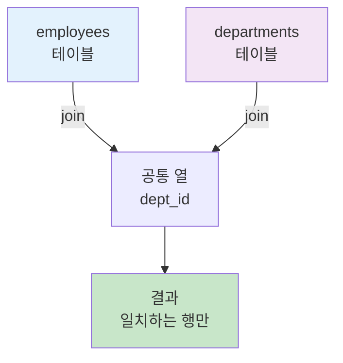
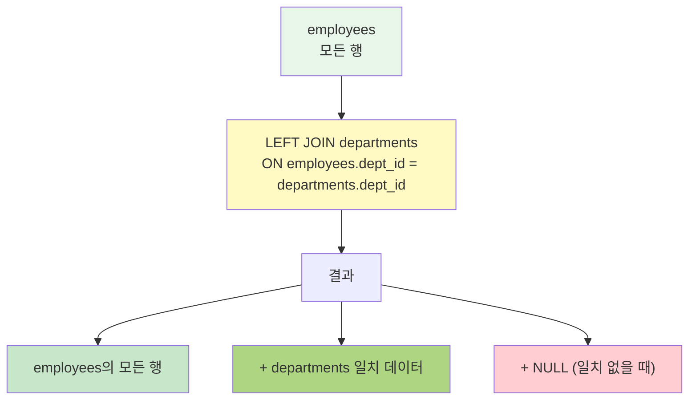

# 5장: JOIN 연산 - 기초편

---

## 📋 수업 개요

**수업 주제**: INNER JOIN과 LEFT JOIN을 이용한 다중 테이블 조회

**수업 목표**

- JOIN의 개념과 필요성 이해
- INNER JOIN 완벽 숙달
- LEFT JOIN (LEFT OUTER JOIN) 이해
- ON 절과 WHERE 절의 차이 구분

---

## 📚 Part 1: 이론 학습

### 이 부분에서 배우는 것

이 섹션에서는 데이터베이스 정규화로 인해 여러 테이블로 분리된 데이터를 조회하기 위한 JOIN의 개념을 배웁니다.    
INNER JOIN으로 양쪽 테이블에 모두 존재하는 데이터를 조회하고, LEFT JOIN으로 한쪽 테이블의 모든 데이터를 포함하면서 다른 테이블의 데이터를 연결하는 방법을 학습합니다. 이를 통해 다중 테이블 조회 능력을 기르게 됩니다.

### 1-1. JOIN이 필요한 이유

데이터베이스 정규화를 통해 중복을 제거한 여러 테이블의 데이터를 조회하기 위해 JOIN이 필요합니다. 예를 들어, 학생 정보와 수강 정보, 강좌 정보가 각각 다른 테이블에 저장되어 있을 때, 학생이 수강한 강좌를 조회하려면 이 테이블들을 연결해야 합니다.

### 1-2. INNER JOIN

INNER JOIN은 양쪽 테이블 모두에 존재하는 데이터만 조회합니다.    

기본 문법    
SELECT * FROM 테이블1    
INNER JOIN 테이블2    
ON 조건;   




### 1-3. LEFT JOIN (LEFT OUTER JOIN)

LEFT JOIN은 왼쪽 테이블의 모든 데이터와 오른쪽 테이블의 일치하는 데이터를 조회합니다.    
왼쪽 테이블의 모든 행이 포함되며, 오른쪽 테이블에 일치하는 데이터가 없으면 NULL이 표시됩니다.



### 1-4. ON 절 vs WHERE 절

ON 절은 JOIN의 조건을 지정하며, 두 테이블을 어떻게 연결할 것인지 정의합니다.    
WHERE 절은 JOIN 결과에 추가 필터를 적용하여 원하는 행만 최종 결과에 포함시킵니다.

---

## 📚 Part 2: 샘플 데이터

### 이 부분에서 배우는 것

이 섹션에서는 JOIN 실습에 사용할 네 개의 테이블(professor, course, student, enrollment)을 생성하고 관계를 설정합니다. 각 테이블의 외래키를 통해 테이블 간 관계를 정의하고, 실제 학사관리 시스템을 모델링한 샘플 데이터를 삽입합니다.

```sql
CREATE DATABASE ch5_join CHARACTER SET utf8mb4;
USE ch5_join;

CREATE TABLE professor (
    professor_id INT PRIMARY KEY AUTO_INCREMENT,
    professor_name VARCHAR(30) NOT NULL,
    department VARCHAR(30)
) CHARACTER SET utf8mb4;

CREATE TABLE course (
    course_id INT PRIMARY KEY AUTO_INCREMENT,
    course_name VARCHAR(30) NOT NULL,
    credits INT,
    professor_id INT,
    FOREIGN KEY (professor_id) REFERENCES professor(professor_id)
) CHARACTER SET utf8mb4;

CREATE TABLE student (
    student_id INT PRIMARY KEY AUTO_INCREMENT,
    student_name VARCHAR(30) NOT NULL,
    major VARCHAR(30)
) CHARACTER SET utf8mb4;

CREATE TABLE enrollment (
    enrollment_id INT PRIMARY KEY AUTO_INCREMENT,
    student_id INT,
    course_id INT,
    grade VARCHAR(2),
    FOREIGN KEY (student_id) REFERENCES student(student_id),
    FOREIGN KEY (course_id) REFERENCES course(course_id)
) CHARACTER SET utf8mb4;

INSERT INTO professor VALUES
(1, '박철수', 'AI소프트웨어학과'),
(2, '이영희', 'AI소프트웨어학과'),
(3, '최준호', 'AI소프트웨어학과');

INSERT INTO course VALUES
(1, '데이터베이스', 3, 1),
(2, '웹프로그래밍', 3, 2),
(3, '인공지능', 3, 1),
(4, '클라우드 컴퓨팅', 3, 3);

INSERT INTO student VALUES
(1, '학생A', 'AI소프트웨어학과'),
(2, '학생B', 'AI소프트웨어학과'),
(3, '학생C', '컴퓨터공학과'),
(4, '학생D', 'AI소프트웨어학과');

INSERT INTO enrollment VALUES
(1, 1, 1, 'A'),
(2, 1, 2, 'B'),
(3, 2, 1, 'A'),
(4, 2, 3, 'B'),
(5, 3, 2, 'C'),
(6, 4, 1, 'A');
```

---

## 💻 Part 3: 실습 (30개 문제)

### 이 부분에서 배우는 것

이 섹션에서는 배운 JOIN을 실제로 실행하여 다양한 쿼리를 작성합니다.    
INNER JOIN으로 관련 데이터를 연결하는 실습부터 시작하여, LEFT JOIN으로 한쪽 테이블의 모든 데이터를 포함하는 실습을 하게 됩니다. 또한 3개 이상의 테이블을 JOIN하고 WHERE 절로 결과를 필터링하는 복잡한 쿼리도 작성하게 되어, 실무에서 필요한 JOIN 능력을 기르게 됩니다.

```sql
-- =====================================================
-- 3-1. INNER JOIN 실습 (기본)
-- =====================================================
-- 실습 5-1~5-11: 기본 INNER JOIN

-- 1. 강좌와 담당 교수, 학점 조회
SELECT c.course_name, p.professor_name, c.credits
FROM course c
INNER JOIN professor p ON c.professor_id = p.professor_id;

-- 2. 학생과 수강한 강좌 조회
SELECT s.student_name, c.course_name
FROM student s
INNER JOIN enrollment e ON s.student_id = e.student_id
INNER JOIN course c ON e.course_id = c.course_id;

-- 3. 학생, 강좌, 성적 조회 (기본)
SELECT s.student_name, c.course_name, e.grade
FROM student s
INNER JOIN enrollment e ON s.student_id = e.student_id
INNER JOIN course c ON e.course_id = c.course_id;

-- 4. 강좌별 수강 학생 수
SELECT c.course_name, COUNT(e.student_id) AS 수강인원
FROM course c
INNER JOIN enrollment e ON c.course_id = e.course_id
GROUP BY c.course_name;

-- 5. 성적이 A인 수강 내역 조회
SELECT s.student_name, c.course_name, e.grade
FROM student s
INNER JOIN enrollment e ON s.student_id = e.student_id
INNER JOIN course c ON e.course_id = c.course_id
WHERE e.grade = 'A';

-- 6. AI소프트웨어학과 학생의 수강 강좌
SELECT s.student_name, c.course_name
FROM student s
INNER JOIN enrollment e ON s.student_id = e.student_id
INNER JOIN course c ON e.course_id = c.course_id
WHERE s.major = 'AI소프트웨어학과';

-- 7. 학생별 수강한 강좌 개수
SELECT s.student_name, COUNT(e.course_id) AS 수강강좌수
FROM student s
INNER JOIN enrollment e ON s.student_id = e.student_id
GROUP BY s.student_name;

-- 8. 박철수 교수의 강좌를 수강하는 학생
SELECT DISTINCT s.student_name
FROM student s
INNER JOIN enrollment e ON s.student_id = e.student_id
INNER JOIN course c ON e.course_id = c.course_id
INNER JOIN professor p ON c.professor_id = p.professor_id
WHERE p.professor_name = '박철수';

-- 9. 데이터베이스 강좌를 수강하는 학생 및 성적
SELECT s.student_name, e.grade
FROM student s
INNER JOIN enrollment e ON s.student_id = e.student_id
INNER JOIN course c ON e.course_id = c.course_id
WHERE c.course_name = '데이터베이스';

-- 10. 강좌별 수강생 목록 (정렬)
SELECT c.course_name, s.student_name, e.grade
FROM course c
INNER JOIN enrollment e ON c.course_id = e.course_id
INNER JOIN student s ON e.student_id = s.student_id
ORDER BY c.course_name;

-- 11. B학점 이상의 강좌 수강 학생
SELECT DISTINCT s.student_name
FROM student s
INNER JOIN enrollment e ON s.student_id = e.student_id
WHERE e.grade IN ('A', 'B');

-- =====================================================
-- 3-2. LEFT JOIN 실습
-- =====================================================
-- 실습 5-12~5-20: LEFT JOIN

-- 12. 모든 교수와 담당 강좌 조회 (강좌 없는 교수도 포함)
SELECT p.professor_name, c.course_name
FROM professor p
LEFT JOIN course c ON p.professor_id = c.professor_id;

-- 13. 모든 학생과 수강한 강좌 (수강 강좌 없는 학생도 포함)
SELECT s.student_name, c.course_name
FROM student s
LEFT JOIN enrollment e ON s.student_id = e.student_id
LEFT JOIN course c ON e.course_id = c.course_id;

-- 14. 모든 강좌와 수강 학생 수 (수강생 없는 강좌도 포함)
SELECT c.course_name, COUNT(e.student_id) AS 수강인원
FROM course c
LEFT JOIN enrollment e ON c.course_id = e.course_id
GROUP BY c.course_name;

-- 15. 강좌별 담당 교수와 수강생 현황
SELECT c.course_name, p.professor_name, s.student_name
FROM course c
LEFT JOIN professor p ON c.professor_id = p.professor_id
LEFT JOIN enrollment e ON c.course_id = e.course_id
LEFT JOIN student s ON e.student_id = s.student_id;

-- 16. 아직 강좌가 배정되지 않은 교수
SELECT p.professor_name
FROM professor p
LEFT JOIN course c ON p.professor_id = c.professor_id
WHERE c.course_id IS NULL;

-- 17. 아직 수강한 강좌가 없는 학생
SELECT s.student_name
FROM student s
LEFT JOIN enrollment e ON s.student_id = e.student_id
WHERE e.enrollment_id IS NULL;

-- 18. 모든 교수별 담당 강좌 수
SELECT p.professor_name, COUNT(c.course_id) AS 담당강좌수
FROM professor p
LEFT JOIN course c ON p.professor_id = c.professor_id
GROUP BY p.professor_name;

-- 19. 모든 학생의 수강 현황 (COUNT 활용)
SELECT s.student_name, COUNT(e.student_id) AS 수강강좌수
FROM student s
LEFT JOIN enrollment e ON s.student_id = e.student_id
GROUP BY s.student_name;

-- 20. 학생별 총 수강학점 (COALESCE 활용)
SELECT s.student_name, COALESCE(SUM(c.credits), 0) AS 총학점
FROM student s
LEFT JOIN enrollment e ON s.student_id = e.student_id
LEFT JOIN course c ON e.course_id = c.course_id
GROUP BY s.student_name;

-- =====================================================
-- 3-3. 복합 JOIN 및 고급 실습
-- =====================================================
-- 실습 5-21~5-30: 복합 JOIN 및 필터링

-- 21. 성적별 학생 수 (집계)
SELECT e.grade, COUNT(e.student_id) AS 학생수
FROM enrollment e
GROUP BY e.grade;

-- 22. 전공별 수강 강좌 수 (LEFT JOIN + GROUP BY)
SELECT s.major, COUNT(DISTINCT e.course_id) AS 수강강좌수
FROM student s
LEFT JOIN enrollment e ON s.student_id = e.student_id
GROUP BY s.major;

-- 23. 2개 이상의 강좌를 수강하는 학생 (HAVING)
SELECT s.student_name, COUNT(e.course_id) AS 수강강좌수
FROM student s
INNER JOIN enrollment e ON s.student_id = e.student_id
GROUP BY s.student_name
HAVING COUNT(e.course_id) >= 2;

-- 24. 교수별 수강생 합계 (LEFT JOIN + COUNT DISTINCT)
SELECT p.professor_name, COUNT(DISTINCT e.student_id) AS 수강생수
FROM professor p
LEFT JOIN course c ON p.professor_id = c.professor_id
LEFT JOIN enrollment e ON c.course_id = e.course_id
GROUP BY p.professor_name;

-- 25. 강좌별 학점 분포 (GROUP BY 2개 컬럼)
SELECT c.course_name, e.grade, COUNT(*) AS 인원
FROM course c
LEFT JOIN enrollment e ON c.course_id = e.course_id
GROUP BY c.course_name, e.grade
ORDER BY c.course_name;

-- 26. AI소프트웨어학과 학생들의 강좌별 수강인원
SELECT c.course_name, COUNT(DISTINCT e.student_id) AS 학과수강인원
FROM course c
LEFT JOIN enrollment e ON c.course_id = e.course_id
LEFT JOIN student s ON e.student_id = s.student_id
WHERE s.major = 'AI소프트웨어학과'
GROUP BY c.course_name;

-- 27. A학점 수강생이 있는 강좌 (DISTINCT)
SELECT DISTINCT c.course_name
FROM course c
INNER JOIN enrollment e ON c.course_id = e.course_id
WHERE e.grade = 'A';

-- 28. 교수 없는 강좌 확인 (WHERE IS NULL)
SELECT c.course_name
FROM course c
LEFT JOIN professor p ON c.professor_id = p.professor_id
WHERE p.professor_id IS NULL;

-- 29. 각 교수의 강좌 개설 현황 (GROUP_CONCAT)
SELECT p.professor_name, 
       GROUP_CONCAT(c.course_name SEPARATOR ', ') AS 개설강좌
FROM professor p
LEFT JOIN course c ON p.professor_id = c.professor_id
GROUP BY p.professor_name;

-- 30. 학생별 이수 강좌 및 학점 (GROUP_CONCAT + SUM)
SELECT s.student_name, 
       GROUP_CONCAT(c.course_name SEPARATOR ', ') AS 이수강좌,
       SUM(c.credits) AS 총학점
FROM student s
INNER JOIN enrollment e ON s.student_id = e.student_id
INNER JOIN course c ON e.course_id = c.course_id
GROUP BY s.student_name;
```

---

## 📝 Part 4: 과제 안내

### 이론 과제

**1번 과제**: INNER JOIN과 LEFT JOIN의 가장 근본적인 차이를 설명하고, 각각이 반환하는 결과 집합의 구성을 구체적으로 서술하세요.

**2번 과제**: ON 절의 역할을 설명하고, WHERE 절과 어떻게 다르게 작용하는지 구체적인 쿼리 예시를 들어 설명하세요.

**3번 과제**: 여러 테이블을 JOIN할 때 테이블의 순서가 결과에 영향을 미치는지 설명하고, LEFT JOIN의 경우 왼쪽 테이블의 위치가 중요한 이유를 논의하세요.

**4번 과제**: NULL 값이 JOIN 연산에 미치는 영향을 설명하고, NULL이 있을 때의 JOIN 결과 예측 방법을 제시하세요.

**5번 과제**: 데이터베이스를 정규화하여 여러 테이블로 분리했을 때 JOIN이 필수적인 이유를 설명하고, JOIN을 사용하지 않았을 때의 문제점을 논의하세요.

제출 형식: Word 또는 PDF 문서 (1-2페이지)

---

### 실습 과제

**1번 과제**: professor, course 테이블을 INNER JOIN하여 강좌명과 담당교수명을 조회하는 SQL 문을 작성하세요.

**2번 과제**: student, enrollment, course 테이블을 순차적으로 INNER JOIN하여 학생명, 수강강좌명, 성적을 모두 표시하는 쿼리를 작성하세요.

**3번 과제**: professor 테이블을 LEFT JOIN하여 담당강좌 정보를 조회하세요. 담당강좌가 없는 교수도 포함되어야 합니다.

**4번 과제**: student 테이블을 LEFT JOIN하여 모든 학생과 그들이 수강한 강좌를 조회하되, 수강 강좌가 없는 학생도 표시되도록 작성하세요.

**5번 과제**: Part 3의 실습 5-1부터 5-30까지 제공된 모든 쿼리를 직접 실행하고, 각 쿼리의 실행 결과를 스크린샷으로 첨부하세요.

제출 형식: SQL 파일 (Ch5_JOIN_Practice_[학번].sql) 및 스크린샷

---


---

수고했습니다.

조정현 교수(peterchokr@gmail.com). 영남이공대학교
