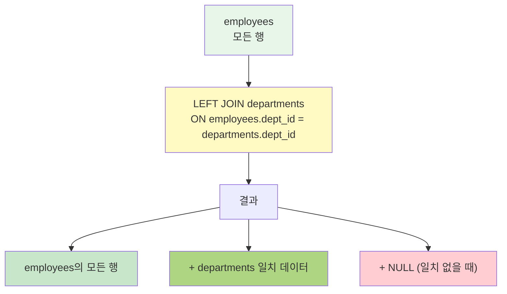
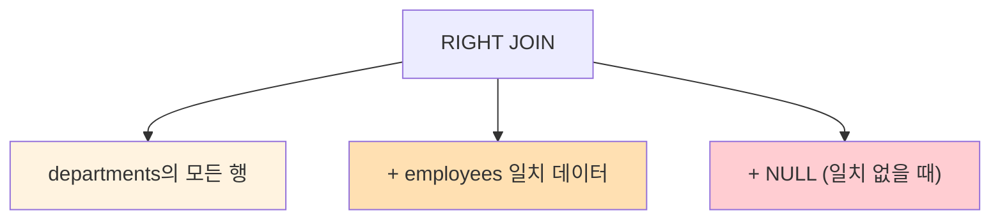
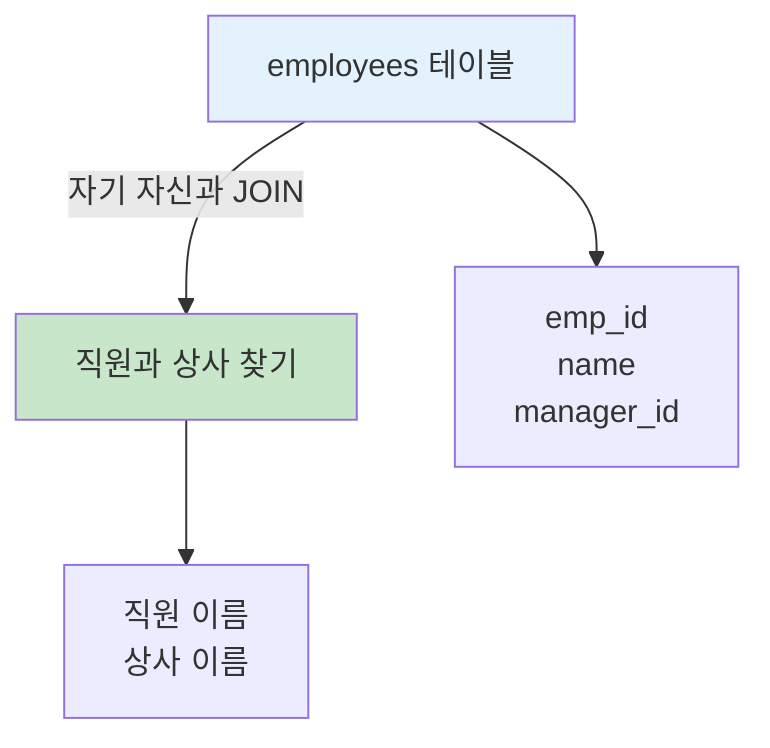
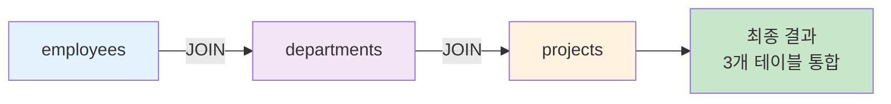
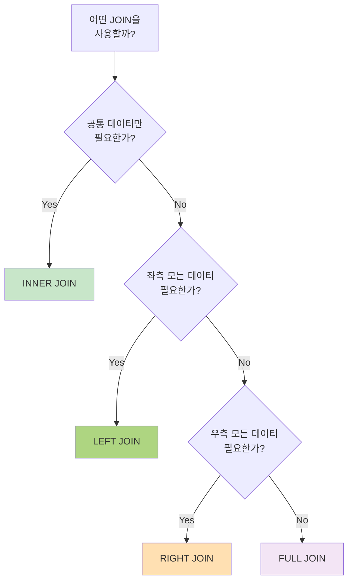

# Chapter 6: JOIN (고급)

## 📖 수업 개요

이 장에서는 관계형 데이터베이스에서 두 개 이상의 테이블을 결합하는 JOIN 연산의 고급 개념을 학습합니다. 이전 장에서 배운 기본 INNER JOIN을 바탕으로, 다양한 종류의 JOIN(LEFT JOIN, RIGHT JOIN, FULL OUTER JOIN, CROSS JOIN, Self Join)과 여러 테이블을 동시에 결합하는 방법, 그리고 JOIN의 성능 최적화에 대해 다룹니다. 실무에서 복잡한 데이터 조회 요구사항을 처리할 수 있는 능력을 개발하는 것이 목표입니다.

---

## 📚 Part 1: 이론 학습

### 🌟 이 부분에서 배우는 것

- LEFT JOIN (왼쪽 외부 조인)의 개념과 특징
- RIGHT JOIN (오른쪽 외부 조인)의 개념과 특징
- FULL OUTER JOIN (완전 외부 조인)의 개념
- CROSS JOIN (교차 조인)의 개념과 활용
- Self Join (자기 자신과의 조인)
- 여러 테이블의 JOIN (3개 이상)
- JOIN 조건과 성능 고려사항
  
- 참고. https://blog.naver.com/jadesea0816/223555667283

---

### 6.1 LEFT JOIN (왼쪽 외부 조인)

**LEFT JOIN**은 왼쪽 테이블의 모든 행을 유지하고, 오른쪽 테이블에서 일치하는 행을 첨가하는 JOIN입니다. 오른쪽 테이블에서 일치하는 행이 없으면 NULL값으로 표시됩니다.

**문법:**

```sql
SELECT column_list
FROM table1
LEFT JOIN table2
ON table1.key = table2.key;
```

**특징:**

- 왼쪽 테이블의 모든 데이터는 항상 결과에 포함됨
- 오른쪽 테이블에서 일치하지 않는 경우 NULL로 표시
- 실무에서 매우 자주 사용되는 형태
- 데이터 누락 여부를 확인할 때 유용

**예시:**

```sql
SELECT e.employee_id, e.name, d.department_name
FROM employees e
LEFT JOIN departments d
ON e.dept_id = d.dept_id;
```



---

### 6.2 RIGHT JOIN (오른쪽 외부 조인)

**RIGHT JOIN**은 LEFT JOIN과 반대로, 오른쪽 테이블의 모든 행을 유지하고 왼쪽 테이블에서 일치하는 행을 첨가합니다.

**문법:**

```sql
SELECT column_list
FROM table1
RIGHT JOIN table2
ON table1.key = table2.key;
```

**특징:**

- 오른쪽 테이블의 모든 데이터는 항상 결과에 포함됨
- 왼쪽 테이블에서 일치하지 않는 경우 NULL로 표시
- LEFT JOIN으로 테이블 순서를 바꾸어 같은 결과를 얻을 수 있음

**예시:**

```sql
SELECT e.employee_id, e.name, d.department_name
FROM employees e
RIGHT JOIN departments d
ON e.dept_id = d.dept_id;
```



---

### 6.3 FULL OUTER JOIN (완전 외부 조인)

**FULL OUTER JOIN**은 양쪽 테이블의 모든 행을 유지하고, 일치하지 않는 부분은 NULL로 표시합니다.

**주의:** MySQL은 FULL OUTER JOIN을 직접 지원하지 않으므로, LEFT JOIN과 RIGHT JOIN을 UNION으로 결합하여 구현합니다.

**구현 방법:**

```sql
SELECT column_list
FROM table1
LEFT JOIN table2 ON table1.key = table2.key
UNION
SELECT column_list
FROM table1
RIGHT JOIN table2 ON table1.key = table2.key;
```

---

### 6.4 CROSS JOIN (교차 조인)

**CROSS JOIN**은 두 테이블의 모든 행을 결합하여 카르테시안 곱(Cartesian Product)을 생성합니다.

**문법:**

```sql
SELECT column_list
FROM table1
CROSS JOIN table2;
-- 또는
SELECT column_list
FROM table1, table2;
```

**특징:**

- 결과 행의 개수 = table1의 행 수 × table2의 행 수
- 매우 큰 결과셋을 생성할 수 있음
- 조건 없이 모든 조합을 필요할 때 사용

---

### 6.5 Self Join (자기 자신과의 조인)

**Self Join**은 같은 테이블을 두 번 사용하여 테이블의 행들 사이의 관계를 찾는 조인입니다.

**문법:**

```sql
SELECT column_list
FROM table1 AS t1
JOIN table1 AS t2
ON t1.key = t2.key;
```

**활용 사례:**

- 직원의 상급자(관리자) 찾기
- 계층 구조 데이터 조회
- 동일한 부서의 직원들 찾기

**예시:**

```sql
SELECT e1.name AS employee_name, e2.name AS manager_name
FROM employees e1
LEFT JOIN employees e2
ON e1.manager_id = e2.employee_id;
```



---

### 6.6 여러 테이블의 JOIN (3개 이상)

실무에서는 3개 이상의 테이블을 결합해야 하는 경우가 빈번합니다.

**예시:**

```sql
SELECT e.name, d.department_name, s.salary_grade
FROM employees e
JOIN departments d ON e.dept_id = d.dept_id
JOIN salary_grades s ON e.salary BETWEEN s.min_salary AND s.max_salary;
```

**중요사항:**

- 각 JOIN 조건을 명확히 작성
- LEFT JOIN 사용 시 순서가 중요함
- 테이블 별칭(AS)으로 가독성 향상



---

### 6.7 JOIN  선택 기준



---

### 6.8 JOIN 성능 최적화

**성능 개선을 위한 고려사항:**

1. **적절한 인덱스 생성**

   - JOIN 조건에 사용되는 열에 인덱스 설정
   - WHERE 조건의 열도 인덱스 고려
2. **JOIN 순서**

   - 작은 테이블을 먼저 JOIN
   - 결과가 적은 테이블을 먼저 처리
3. **필요한 열만 SELECT**

   - SELECT * 대신 필요한 열만 명시
   - 불필요한 열의 조회 회피
4. **조인 조건 명시**

   - 명시적 JOIN 문법 사용 (INNER JOIN, LEFT JOIN 등)
   - 불명시적 조인(쉼표) 사용 회피

---

## 📚 Part 2: 샘플 데이터

### employees 테이블

```sql
CREATE DATABASE ch6_join CHARACTER SET utf8mb4;
USE ch6_join;

CREATE TABLE employees (
    employee_id INT PRIMARY KEY AUTO_INCREMENT,
    name VARCHAR(50) NOT NULL,
    dept_id INT,
    manager_id INT,
    salary DECIMAL(10, 2)
);

INSERT INTO employees VALUES
(1, '김철수', 1, NULL, 5000000),
(2, '이영희', 1, 1, 4000000),
(3, '박민준', 2, 1, 4500000),
(4, '최순신', 2, 3, 3500000),
(5, '강감찬', 3, 1, 4200000),
(6, '이순신', 3, 5, 3800000),
(7, '장보고', 1, 1, 3200000);
```

### departments 테이블

```sql
CREATE TABLE departments (
    dept_id INT PRIMARY KEY AUTO_INCREMENT,
    department_name VARCHAR(50) NOT NULL,
    location VARCHAR(50)
);

INSERT INTO departments VALUES
(1, '영업부', '서울'),
(2, '기술부', '대전'),
(3, '인사부', '서울'),
(4, '재무부', '부산');
```

### salary_grades 테이블

```sql
CREATE TABLE salary_grades (
    grade CHAR(1) PRIMARY KEY,
    min_salary DECIMAL(10, 2),
    max_salary DECIMAL(10, 2)
);

INSERT INTO salary_grades VALUES
('A', 5000000, 6000000),
('B', 4000000, 4999999),
('C', 3000000, 3999999),
('D', 2000000, 2999999);
```

---

## 💻 Part 3: 실습

### 🌟 이 부분에서 배우는 것

- 다양한 JOIN 유형의 실전 활용
- 복합 JOIN 쿼리 작성
- NULL 값 처리 방법
- 결과 검증 및 해석

---

### 6-1. LEFT JOIN 기본

employees 테이블에서 모든 직원과 그들이 속한 부서명을 조회하세요. 부서가 없는 직원도 포함되어야 합니다.

```sql
SELECT e.employee_id, e.name, d.department_name
FROM employees e
LEFT JOIN departments d
ON e.dept_id = d.dept_id;
```

---

### 6-2. LEFT JOIN과 WHERE 조건

employees와 departments를 LEFT JOIN하여 서울 지역 부서의 직원들만 조회하세요. (부서가 NULL인 경우는 제외)

```sql
SELECT e.employee_id, e.name, d.department_name, d.location
FROM employees e
LEFT JOIN departments d
ON e.dept_id = d.dept_id
WHERE d.location = '서울';
```

---

### 6-3. RIGHT JOIN 활용

departments와 employees를 RIGHT JOIN하여 모든 부서와 각 부서의 직원 수를 조회하세요.

```sql
SELECT d.department_name, COUNT(e.employee_id) AS employee_count
FROM employees e
RIGHT JOIN departments d
ON e.dept_id = d.dept_id
GROUP BY d.dept_id, d.department_name;
```

---

### 6-4. Self Join 기본

employees 테이블에서 각 직원의 이름과 상급자(관리자)의 이름을 함께 조회하세요.

```sql
SELECT e1.name AS employee_name, e2.name AS manager_name
FROM employees e1
LEFT JOIN employees e2
ON e1.manager_id = e2.employee_id;
```

---

### 6-5. Self Join으로 동료 찾기

같은 부서에 속한 직원들의 쌍을 모두 찾아 직원1과 직원2를 조회하세요.

```sql
SELECT e1.name AS employee1, e2.name AS employee2, e1.dept_id
FROM employees e1
JOIN employees e2
ON e1.dept_id = e2.dept_id
WHERE e1.employee_id < e2.employee_id;
```

---

### 6-6. CROSS JOIN 이해

부서와 급여등급을 CROSS JOIN하여 모든 조합을 생성하세요.

```sql
SELECT d.department_name, s.grade
FROM departments d
CROSS JOIN salary_grades s
ORDER BY d.department_name, s.grade;
```

---

### 6-7. 3개 테이블 JOIN

employees, departments, salary_grades를 JOIN하여 직원명, 부서명, 급여등급을 조회하세요.

```sql
SELECT e.employee_id, e.name, d.department_name, s.grade
FROM employees e
JOIN departments d
ON e.dept_id = d.dept_id
JOIN salary_grades s
ON e.salary BETWEEN s.min_salary AND s.max_salary;
```

---

### 6-8. LEFT JOIN 체이닝

employees LEFT JOIN departments 하여 직원명, 부서명을 조회하세요.

```sql
SELECT e.employee_id, e.name, d.department_name, d.location
FROM employees e
LEFT JOIN departments d
ON e.dept_id = d.dept_id
ORDER BY e.employee_id;
```

---


### 6-9. JOIN된 테이블에서 집계

employees와 departments를 JOIN하여 부서별 직원 수를 조회하세요.

```sql
SELECT d.department_name, COUNT(e.employee_id) AS employee_count
FROM employees e
JOIN departments d
ON e.dept_id = d.dept_id
GROUP BY d.dept_id, d.department_name;
```

---

### 6-10. 중복 제거

여러 테이블을 JOIN할 때 발생하는 중복을 DISTINCT로 제거하세요.

```sql
SELECT DISTINCT d.department_name
FROM employees e
JOIN departments d
ON e.dept_id = d.dept_id;
```

---

### 6-11. JOIN 결과 정렬

여러 테이블을 JOIN한 후 다중 열로 정렬하세요.

```sql
SELECT e.name, d.department_name, e.salary
FROM employees e
JOIN departments d
ON e.dept_id = d.dept_id
ORDER BY d.department_name ASC, e.salary DESC;
```

---

### 6-12. JOIN과 LIMIT

JOIN된 결과에서 상위 N개 행만 조회하세요.

```sql
SELECT e.name, e.salary, d.department_name
FROM employees e
JOIN departments d
ON e.dept_id = d.dept_id
ORDER BY e.salary DESC
LIMIT 5;
```

---

### 6-13. 조건부 JOIN

조건에 따라 다른 데이터를 조회하세요.

```sql
SELECT e.name, d.department_name,
       CASE 
           WHEN e.salary >= 5000000 THEN '상위'
           WHEN e.salary >= 4000000 THEN '중위'
           ELSE '하위'
       END AS salary_level
FROM employees e
JOIN departments d
ON e.dept_id = d.dept_id;
```

---

### 6-14. 집계함수와 JOIN

JOIN된 데이터의 평균을 계산하세요.

```sql
SELECT d.department_name, 
       COUNT(e.employee_id) AS emp_count,
       AVG(e.salary) AS avg_salary,
       MAX(e.salary) AS max_salary
FROM employees e
JOIN departments d
ON e.dept_id = d.dept_id
GROUP BY d.dept_id, d.department_name;
```

---

### 6-15. FULL OUTER JOIN 구현

LEFT JOIN과 RIGHT JOIN을 UNION으로 결합하여 FULL OUTER JOIN을 구현하세요.

```sql
SELECT COALESCE(e.employee_id, 0) AS emp_id,
       COALESCE(e.name, '없음') AS emp_name,
       COALESCE(d.department_name, '없음') AS dept_name
FROM employees e
LEFT JOIN departments d
ON e.dept_id = d.dept_id
UNION
SELECT COALESCE(e.employee_id, 0) AS emp_id,
       COALESCE(e.name, '없음') AS emp_name,
       COALESCE(d.department_name, '없음') AS dept_name
FROM employees e
RIGHT JOIN departments d
ON e.dept_id = d.dept_id;
```

---

### 6-16. Self Join으로 범위 조회

같은 테이블에서 범위를 조회하세요.

```sql
SELECT s1.grade AS current_grade, s2.grade AS next_grade
FROM salary_grades s1
JOIN salary_grades s2
ON s1.max_salary < s2.min_salary;
```

---

### 6-17. JOIN 결과에 ORDER BY

JOIN된 결과를 정렬하세요.

```sql
SELECT e.name, e.salary, d.department_name
FROM employees e
JOIN departments d
ON e.dept_id = d.dept_id
ORDER BY e.salary DESC, e.name ASC;
```

---

### 6-18. 문자열 함수와 JOIN

JOIN 결과에 문자열 함수를 사용하세요.

```sql
SELECT CONCAT(e.name, ' - ', d.department_name) AS employee_info,
       e.salary
FROM employees e
JOIN departments d
ON e.dept_id = d.dept_id;
```

---

## 📝 Part 4: 과제 안내

### 이론 과제

**1번 과제**: LEFT JOIN과 RIGHT JOIN의 차이점을 설명하고, 언제 각각을 사용해야 하는지 실무 사례를 들어 서술하세요. 같은 결과를 LEFT JOIN과 RIGHT JOIN으로 구현하는 방법도 보여주세요.

**2번 과제**: Self Join의 개념을 설명하고, 직원과 관리자 관계, 범주 대분류와 소분류 관계 등 Self Join이 필요한 사례를 3가지 이상 제시하세요.

**3번 과제**: FULL OUTER JOIN을 MySQL에서 구현하는 방법을 설명하고, LEFT JOIN, RIGHT JOIN, UNION을 사용한 구현 쿼리를 작성하세요. FULL OUTER JOIN이 필요한 상황을 분석하세요.

**4번 과제**: 3개 이상의 테이블을 JOIN할 때 고려해야 할 사항들을 서술하세요. 여러 LEFT JOIN을 연결할 때의 주의사항과 성능 최적화 방법을 논의하세요.

**5번 과제**: JOIN의 성능에 영향을 미치는 요소들(인덱스, 조인 순서, 조인 조건)을 설명하고, 각각의 최적화 방법을 제시하세요. 실제 성능 측정 방법도 설명하세요.

제출 형식: Word 또는 PDF 문서 (2-3페이지)

---

### 실습 과제

**1번 과제**: 샘플 데이터베이스에서 3개 이상의 테이블을 JOIN하여 다음 정보를 조회하는 쿼리를 작성하세요: 직원명, 부서명, 부서 위치, 급여, 급여 등급. 모든 직원이 결과에 포함되어야 합니다.

**2번 과제**: employees 테이블을 Self Join하여 다음을 조회하세요:

- 각 직원과 그 직원의 상급자명
- 같은 부서의 모든 직원 쌍
- 부서장(manager_id가 NULL)과 그 부하직원들

**3번 과제**: LEFT JOIN과 HAVING을 사용하여 다음 조회를 수행하세요:

- 부서별 직원 수 (직원이 없는 부서도 포함)
- 직원이 5명 이상인 부서만 필터링
- 결과를 부서명의 오름차순으로 정렬

**4번 과제**: NOT EXISTS와 LEFT JOIN을 사용하여 다음을 조회하세요:

- 특정 프로젝트에 배정되지 않은 직원
- 승인되지 않은 요청
- 하위 카테고리가 없는 상위 카테고리

**5번 과제**: Part 3의 실습 6-1부터 6-18까지 제공된 모든 쿼리를 직접 실행하고, 각 쿼리의 결과를 스크린샷으로 첨부하세요. 추가로 5개 이상의 창의적인 JOIN 쿼리를 작성하여 그 결과도 함께 제시하고, 각 쿼리의 목적과 활용 사례를 설명하세요.

제출 형식: SQL 파일 (Ch6_JOIN_Advanced_[학번].sql) 및 결과 스크린샷

---

수고했습니다.

조정현 교수(peterchokr@gmail.com). 영남이공대학교
