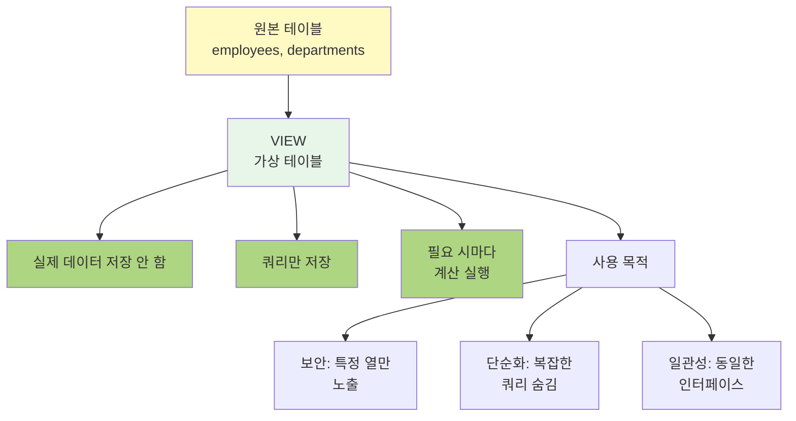

# Chapter 10: 뷰 (View)와 저장프로시저 (Stored Procedure)

## 📖 수업 개요

이 장에서는 데이터베이스의 논리적 추상화를 제공하는 뷰(View)와 재사용 가능한 SQL 루틴인 저장프로시저(Stored Procedure)를 학습합니다. 뷰를 사용하여 복잡한 쿼리를 단순화하고 데이터 접근을 제어하며, 저장프로시저로 반복적인 작업을 자동화하고 애플리케이션 로직을 데이터베이스에 구현하는 방법을 다룹니다. 데이터베이스의 유지보수성과 보안을 강화하는 것이 목표입니다.

---

## 📚 Part 1: 이론 학습

### 🌟 이 부분에서 배우는 것

- 뷰의 개념과 생성
- 뷰의 활용 사례
- 뷰의 장단점
- 저장프로시저의 개념과 문법
- 저장프로시저의 매개변수
- 저장프로시저 실행 및 관리

---

### 10.1 뷰 (View)의 개념

**뷰**는 하나 이상의 테이블을 기반으로 하는 가상 테이블입니다.

**특징:**

- 실제 데이터를 저장하지 않음 (논리적 추상화)
- SELECT 쿼리로 정의됨
- 테이블처럼 SELECT로 조회 가능
- 복잡한 조인이나 집계를 단순화




**뷰 생성:**

```sql
CREATE VIEW view_name AS
SELECT column1, column2, ...
FROM table_name
WHERE condition;
```

**뷰 조회:**

```sql
SELECT * FROM view_name;
```

---

### 10.2 뷰의 활용 사례

**1. 복잡한 쿼리 단순화:**

```sql
CREATE VIEW sales_summary AS
SELECT p.product_name, COUNT(*) AS sales_count, SUM(s.quantity) AS total_qty
FROM products p
JOIN sales s ON p.product_id = s.product_id
GROUP BY p.product_id, p.product_name;

-- 사용
SELECT * FROM sales_summary WHERE total_qty > 100;
```

**2. 데이터 보안:**

```sql
CREATE VIEW employee_public AS
SELECT employee_id, name, hire_date
FROM employees;  -- 급여 정보 제외
```

**3. 데이터 추상화:**

```sql
CREATE VIEW current_employees AS
SELECT * FROM employees
WHERE termination_date IS NULL;
```

---

### 10.3 뷰 수정과 삭제

**뷰 수정:**

```sql
ALTER VIEW view_name AS
SELECT column1, column2, ...
FROM table_name;
```

**뷰 삭제:**

```sql
DROP VIEW view_name;
DROP VIEW IF EXISTS view_name;  -- 존재하지 않으면 오류 무시
```

**여러 뷰 삭제:**

```sql
DROP VIEW view1, view2, view3;
```

---

### 10.4 수정 가능한 뷰 (Updatable View)

특정 조건을 만족하면 뷰에 INSERT, UPDATE, DELETE가 가능합니다.

**조건:**

- 단일 테이블을 기반으로 함
- GROUP BY, DISTINCT, JOIN을 포함하지 않음
- 서브쿼리, UNION을 포함하지 않음
- HAVING, LIMIT을 포함하지 않음

**예시:**

```sql
CREATE VIEW employee_view AS
SELECT employee_id, name, salary FROM employees;

-- 뷰를 통한 수정 가능
UPDATE employee_view SET salary = 5000000 WHERE employee_id = 1;
```

---

### 10.5 저장프로시저 (Stored Procedure)

**저장프로시저**는 데이터베이스에 저장되는 재사용 가능한 SQL 루틴입니다.

**특징:**

- 전제조건, 반복문, 조건문 포함 가능
- 매개변수 사용 가능 (IN, OUT, INOUT)
- 트랜잭션 제어 가능
- 성능 향상 (미리 컴파일됨)

**생성:**

```sql
CREATE PROCEDURE procedure_name (
  IN parameter1 INT,
  OUT parameter2 VARCHAR(50)
)
BEGIN
  -- 프로시저 본문
  SELECT column INTO parameter2 FROM table WHERE id = parameter1;
END;
```

---

### 10.6 저장프로시저 매개변수

**IN (입력 매개변수):**

```sql
CREATE PROCEDURE get_employee (IN emp_id INT)
BEGIN
  SELECT * FROM employees WHERE employee_id = emp_id;
END;
```

**OUT (출력 매개변수):**

```sql
CREATE PROCEDURE get_employee_count (OUT count INT)
BEGIN
  SELECT COUNT(*) INTO count FROM employees;
END;
```

**INOUT (입출력 매개변수):**

```sql
CREATE PROCEDURE process_salary (INOUT salary DECIMAL)
BEGIN
  SET salary = salary * 1.1;
END;
```

---

### 10.7 저장프로시저의 제어 구조

**IF-THEN-ELSE:**

```sql
CREATE PROCEDURE check_salary (IN emp_id INT)
BEGIN
  DECLARE salary DECIMAL;
  SELECT salary_amount INTO salary FROM employees WHERE employee_id = emp_id;
  
  IF salary > 5000000 THEN
    SELECT 'High Salary';
  ELSEIF salary > 4000000 THEN
    SELECT 'Medium Salary';
  ELSE
    SELECT 'Low Salary';
  END IF;
END;
```

**WHILE 루프:**

```sql
CREATE PROCEDURE insert_sample_data (IN count INT)
BEGIN
  DECLARE i INT DEFAULT 1;
  WHILE i <= count DO
    INSERT INTO temp_table VALUES (i, CONCAT('Data', i));
    SET i = i + 1;
  END WHILE;
END;
```

**CASE 문:**

```sql
CREATE PROCEDURE get_grade (IN score INT, OUT grade CHAR)
BEGIN
  CASE
    WHEN score >= 90 THEN SET grade = 'A';
    WHEN score >= 80 THEN SET grade = 'B';
    WHEN score >= 70 THEN SET grade = 'C';
    ELSE SET grade = 'F';
  END CASE;
END;
```

---

### 10.8 저장프로시저 실행

**CALL 문으로 실행:**

```sql
CALL procedure_name(parameter_list);
```

**예시:**

```sql
CALL get_employee(1);

-- OUT 매개변수로 결과 받기
CALL get_employee_count(@count);
SELECT @count;
```

---

### 10.9 저장프로시저 삭제

**프로시저 삭제:**

```sql
DROP PROCEDURE procedure_name;
DROP PROCEDURE IF EXISTS procedure_name;
```

---

### 10.10 뷰 vs 테이블

| 특성   | 뷰                 | 테이블           |
| ------ | ------------------ | ---------------- |
| 저장소 | 가상 (정의만 저장) | 실제 데이터 저장 |
| 성능   | 매번 계산          | 사전 저장        |
| 수정   | 제한적             | 자유로움         |
| 용도   | 추상화, 보안       | 데이터 저장      |

---

## 📚 Part 2: 샘플 데이터

### employees 테이블

```sql
CREATE TABLE employees (
    employee_id INT PRIMARY KEY AUTO_INCREMENT,
    name VARCHAR(50),
    dept_id INT,
    salary DECIMAL(10, 2),
    hire_date DATE
);

INSERT INTO employees VALUES
(1, '김철수', 1, 5000000, '2020-01-15'),
(2, '이영희', 1, 4000000, '2020-06-20'),
(3, '박민준', 2, 4500000, '2019-03-10');
```

---

## 💻 Part 3: 실습

### 🌟 이 부분에서 배우는 것

- 뷰의 다양한 활용
- 저장프로시저의 작성과 실행
- 프로시저 디버깅
- 성능 고려사항

---

### 10-1. 단순 뷰 생성

한 테이블을 기반으로 특정 열만 포함하는 뷰를 생성하세요.

```sql
CREATE VIEW employee_names AS
SELECT employee_id, name, hire_date
FROM employees;

SELECT * FROM employee_names;
```

---

### 10-2. JOIN 뷰

여러 테이블을 조인한 뷰를 생성하세요.

```sql
CREATE VIEW employee_department_view AS
SELECT e.employee_id, e.name, d.department_name, d.location
FROM employees e
JOIN departments d ON e.dept_id = d.dept_id;

SELECT * FROM employee_department_view;
```

---

### 10-3. 집계 뷰

GROUP BY를 포함하는 집계 뷰를 생성하세요.

```sql
CREATE VIEW dept_salary_summary AS
SELECT dept_id, COUNT(*) AS emp_count, AVG(salary) AS avg_salary
FROM employees
GROUP BY dept_id;

SELECT * FROM dept_salary_summary;
```

---

### 10-4. 조건부 뷰

WHERE 조건을 포함하는 뷰를 생성하세요.

```sql
CREATE VIEW high_salary_employees AS
SELECT employee_id, name, salary
FROM employees
WHERE salary > 4500000;

SELECT * FROM high_salary_employees;
```

---

### 10-5. 뷰 조회

생성한 뷰에서 데이터를 조회하세요.

```sql
SELECT name, salary
FROM high_salary_employees
ORDER BY salary DESC;
```

---

### 10-6. 뷰 수정

기존 뷰의 정의를 변경하세요.

```sql
ALTER VIEW high_salary_employees AS
SELECT employee_id, name, salary, dept_id
FROM employees
WHERE salary > 4000000;
```

---

### 10-7. 뷰 삭제

뷰를 삭제하세요.

```sql
DROP VIEW IF EXISTS high_salary_employees;
```

---

### 10-8. 수정 가능한 뷰

INSERT, UPDATE, DELETE가 가능한 뷰를 생성하고 수정하세요.

```sql
CREATE VIEW employee_view AS
SELECT employee_id, name, salary FROM employees;

-- 뷰를 통한 수정
UPDATE employee_view SET salary = 5000000 WHERE employee_id = 1;
```

---

### 10-9. 뷰를 통한 INSERT

뷰를 통해 데이터를 삽입하세요.

```sql
INSERT INTO employee_view (name, salary)
VALUES ('박수정', 4200000);
```

---

### 10-10. 뷰를 통한 UPDATE

뷰를 통해 데이터를 수정하세요.

```sql
UPDATE employee_view SET salary = 4800000 WHERE employee_id = 2;
```

---

### 10-11. 기본 저장프로시저

입력 매개변수를 받는 간단한 저장프로시저를 생성하세요.

```sql
CREATE PROCEDURE GetEmployeeInfo (IN emp_id INT)
BEGIN
  SELECT employee_id, name, salary, dept_id
  FROM employees
  WHERE employee_id = emp_id;
END;

CALL GetEmployeeInfo(1);
```

---

### 10-12. 출력 매개변수

OUT 매개변수를 사용하는 저장프로시저를 생성하세요.

```sql
CREATE PROCEDURE GetEmployeeCount (OUT emp_count INT)
BEGIN
  SELECT COUNT(*) INTO emp_count FROM employees;
END;

CALL GetEmployeeCount(@count);
SELECT @count;
```

---

### 10-13. 입출력 매개변수

INOUT 매개변수를 사용하는 저장프로시저를 생성하세요.

```sql
CREATE PROCEDURE IncreaseSalary (INOUT salary DECIMAL)
BEGIN
  SET salary = salary * 1.1;
END;

SET @my_salary = 5000000;
CALL IncreaseSalary(@my_salary);
SELECT @my_salary;
```

---

### 10-14. IF-ELSE 조건문

조건문을 포함하는 저장프로시저를 생성하세요.

```sql
CREATE PROCEDURE CheckSalaryLevel (IN emp_id INT)
BEGIN
  DECLARE emp_salary DECIMAL;
  SELECT salary INTO emp_salary FROM employees WHERE employee_id = emp_id;
  
  IF emp_salary > 5000000 THEN
    SELECT '상위' AS salary_level;
  ELSEIF emp_salary > 4000000 THEN
    SELECT '중위' AS salary_level;
  ELSE
    SELECT '하위' AS salary_level;
  END IF;
END;

CALL CheckSalaryLevel(1);
```

---

### 10-15. CASE 문

CASE 문을 사용하는 저장프로시저를 생성하세요.

```sql
CREATE PROCEDURE GetGrade (IN score INT, OUT grade CHAR(1))
BEGIN
  SET grade = CASE
    WHEN score >= 90 THEN 'A'
    WHEN score >= 80 THEN 'B'
    WHEN score >= 70 THEN 'C'
    ELSE 'F'
  END;
END;

CALL GetGrade(85, @result);
SELECT @result;
```

---

### 10-16. WHILE 루프

반복문을 포함하는 저장프로시저를 생성하세요.

```sql
CREATE PROCEDURE InsertSampleData (IN count INT)
BEGIN
  DECLARE i INT DEFAULT 1;
  WHILE i <= count DO
    INSERT INTO temp_table VALUES (i, CONCAT('Data', i));
    SET i = i + 1;
  END WHILE;
END;

CALL InsertSampleData(5);
```

---

### 10-17. 저장프로시저 실행

프로시저를 호출하여 실행하세요.

```sql
CALL GetEmployeeInfo(1);
```

---

### 10-18. 변수 선언과 할당

프로시저에서 변수를 선언하고 사용하세요.

```sql
CREATE PROCEDURE CalculateSalaryInfo ()
BEGIN
  DECLARE total_salary DECIMAL;
  DECLARE avg_salary DECIMAL;
  DECLARE emp_count INT;
  
  SELECT SUM(salary) INTO total_salary FROM employees;
  SELECT AVG(salary) INTO avg_salary FROM employees;
  SELECT COUNT(*) INTO emp_count FROM employees;
  
  SELECT total_salary, avg_salary, emp_count;
END;

CALL CalculateSalaryInfo();
```

---

### 10-19. 트랜잭션 포함 프로시저

트랜잭션 제어를 포함하는 저장프로시저를 생성하세요.

```sql
CREATE PROCEDURE TransferSalary (IN from_emp_id INT, IN to_emp_id INT, IN amount DECIMAL)
BEGIN
  START TRANSACTION;
  
  UPDATE employees SET salary = salary - amount WHERE employee_id = from_emp_id;
  UPDATE employees SET salary = salary + amount WHERE employee_id = to_emp_id;
  
  COMMIT;
END;

CALL TransferSalary(1, 2, 100000);
```

---

### 10-20. 에러 처리

DECLARE HANDLER로 에러를 처리하세요.

```sql
CREATE PROCEDURE SafeInsert (IN emp_name VARCHAR(50), IN dept_id INT)
BEGIN
  DECLARE CONTINUE HANDLER FOR SQLEXCEPTION
  BEGIN
    SELECT 'Error occurred' AS status;
  END;
  
  INSERT INTO employees (name, dept_id) VALUES (emp_name, dept_id);
  SELECT 'Success' AS status;
END;

CALL SafeInsert('테스트', 1);
```

---

### 10-21. 커서 (Cursor)

커서를 사용하여 행을 반복 처리하세요.

```sql
CREATE PROCEDURE ProcessEmployees ()
BEGIN
  DECLARE done INT DEFAULT 0;
  DECLARE emp_name VARCHAR(50);
  DECLARE emp_cursor CURSOR FOR SELECT name FROM employees;
  DECLARE CONTINUE HANDLER FOR NOT FOUND SET done = TRUE;
  
  OPEN emp_cursor;
  read_loop: LOOP
    FETCH emp_cursor INTO emp_name;
    IF done THEN LEAVE read_loop; END IF;
    INSERT INTO processed_employees VALUES (emp_name);
  END LOOP;
  CLOSE emp_cursor;
END;

CALL ProcessEmployees();
```

---

### 10-22. 동적 SQL

PREPARE와 EXECUTE를 사용하세요.

```sql
CREATE PROCEDURE DynamicQuery (IN table_name VARCHAR(50))
BEGIN
  SET @query = CONCAT('SELECT COUNT(*) FROM ', table_name);
  PREPARE stmt FROM @query;
  EXECUTE stmt;
  DEALLOCATE PREPARE stmt;
END;

CALL DynamicQuery('employees');
```

---

### 10-23. 데이터 검증 프로시저

데이터 무결성을 검증하는 프로시저를 생성하세요.

```sql
CREATE PROCEDURE ValidateEmployee (IN emp_id INT, OUT is_valid INT)
BEGIN
  IF EXISTS(SELECT 1 FROM employees WHERE employee_id = emp_id) THEN
    SET is_valid = 1;
  ELSE
    SET is_valid = 0;
  END IF;
END;

CALL ValidateEmployee(1, @valid);
SELECT @valid;
```

---

### 10-24. 데이터 변환 프로시저

데이터 형식을 변환하는 프로시저를 생성하세요.

```sql
CREATE PROCEDURE ConvertSalaryData ()
BEGIN
  UPDATE employees
  SET salary = ROUND(salary / 1000) * 1000;
END;

CALL ConvertSalaryData();
```

---

### 10-25. 배치 처리 프로시저

대량의 데이터를 처리하는 프로시저를 생성하세요.

```sql
CREATE PROCEDURE BatchIncreaseSalary (IN percentage DECIMAL)
BEGIN
  UPDATE employees SET salary = salary * (1 + percentage / 100);
END;

CALL BatchIncreaseSalary(10);
```

---

### 10-26. 통계 계산 프로시저

통계 정보를 계산하는 프로시저를 생성하세요.

```sql
CREATE PROCEDURE GetSalaryStatistics (OUT total DECIMAL, OUT average DECIMAL, OUT max DECIMAL)
BEGIN
  SELECT SUM(salary), AVG(salary), MAX(salary)
  INTO total, average, max FROM employees;
END;

CALL GetSalaryStatistics(@t, @a, @m);
SELECT @t AS total, @a AS average, @m AS max;
```

---

### 10-27. 데이터 정제 프로시저

데이터를 정제하는 프로시저를 생성하세요.

```sql
CREATE PROCEDURE CleanData ()
BEGIN
  DELETE FROM employees WHERE salary IS NULL;
  UPDATE employees SET name = TRIM(name);
END;

CALL CleanData();
```

---

### 10-28. 로그 기록 프로시저

작업 내역을 로그에 기록하는 프로시저를 생성하세요.

```sql
CREATE PROCEDURE LogAction (IN action VARCHAR(50), IN details VARCHAR(255))
BEGIN
  INSERT INTO action_log (action, details, created_at)
  VALUES (action, details, NOW());
END;

CALL LogAction('UPDATE', 'Employee salary updated');
```

---

### 10-29. 마이그레이션 프로시저

데이터를 이동하는 프로시저를 생성하세요.

```sql
CREATE PROCEDURE MigrateOldEmployees ()
BEGIN
  INSERT INTO employees_archive
  SELECT * FROM employees WHERE hire_date < '2020-01-01';
  
  DELETE FROM employees WHERE hire_date < '2020-01-01';
END;

CALL MigrateOldEmployees();
```

---

### 10-30. 백업 프로시저

데이터를 백업하는 프로시저를 생성하세요.

```sql
CREATE PROCEDURE BackupData ()
BEGIN
  INSERT INTO employees_backup SELECT * FROM employees;
END;

CALL BackupData();
```

---

### 10-31. 복잡한 비즈니스 로직 프로시저

여러 테이블을 수정하는 복합 프로시저를 생성하세요.

```sql
CREATE PROCEDURE PromoteEmployee (IN emp_id INT, IN new_dept_id INT, IN new_salary DECIMAL)
BEGIN
  START TRANSACTION;
  UPDATE employees SET dept_id = new_dept_id, salary = new_salary WHERE employee_id = emp_id;
  INSERT INTO promotion_history VALUES (emp_id, new_dept_id, new_salary, NOW());
  COMMIT;
END;

CALL PromoteEmployee(1, 2, 5500000);
```

---

### 10-32. 재귀 프로시저

계층 구조를 처리하는 재귀 프로시저를 생성하세요.

```sql
CREATE PROCEDURE PrintHierarchy (IN emp_id INT, IN level INT)
BEGIN
  DECLARE manager_id INT;
  SELECT manager_id INTO manager_id FROM employees WHERE employee_id = emp_id;
  
  IF manager_id IS NULL THEN
    SELECT REPEAT('  ', level), name FROM employees WHERE employee_id = emp_id;
  ELSE
    CALL PrintHierarchy(manager_id, level + 1);
    SELECT REPEAT('  ', level), name FROM employees WHERE employee_id = emp_id;
  END IF;
END;

CALL PrintHierarchy(1, 0);
```

---

### 10-33. 성능 모니터링 프로시저

성능 정보를 수집하는 프로시저를 생성하세요.

```sql
CREATE PROCEDURE MonitorPerformance ()
BEGIN
  SELECT 
    (SELECT COUNT(*) FROM employees) AS emp_count,
    (SELECT COUNT(*) FROM departments) AS dept_count,
    (SELECT AVG(salary) FROM employees) AS avg_salary;
END;

CALL MonitorPerformance();
```

---

### 10-34. 프로시저 목록 확인

생성된 모든 프로시저를 조회하세요.

```sql
SHOW PROCEDURE STATUS WHERE Db = 'database_name';
```

---

### 10-35. 프로시저 수정

기존 프로시저를 수정하세요.

```sql
DROP PROCEDURE GetEmployeeInfo;

CREATE PROCEDURE GetEmployeeInfo (IN emp_id INT)
BEGIN
  SELECT employee_id, name, salary, dept_id, hire_date
  FROM employees
  WHERE employee_id = emp_id;
END;
```

---

### 10-36. 프로시저 삭제

프로시저를 삭제하세요.

```sql
DROP PROCEDURE IF EXISTS GetEmployeeInfo;
```

---

### 10-37. 뷰 목록 확인

데이터베이스의 모든 뷰를 조회하세요.

```sql
SHOW TABLES WHERE Table_type = 'VIEW';
```

---

### 10-38. 뷰 정보 조회

뷰의 정의를 확인하세요.

```sql
SHOW CREATE VIEW employee_department_view;
```

---

### 10-39. 프로시저와 뷰 성능 비교

프로시저와 뷰의 성능을 비교하세요.

```sql
-- 뷰 방식
SELECT * FROM employee_department_view LIMIT 10;

-- 프로시저 방식
CALL GetEmployeeInfo(1);
```

---

### 10-40. 실무 시나리오 프로시저

급여 계산, 성과급 지급 등 실무 시나리오의 프로시저를 생성하세요.

```sql
CREATE PROCEDURE CalculateBonus (IN dept_id INT, IN bonus_percentage DECIMAL)
BEGIN
  START TRANSACTION;
  
  UPDATE employees
  SET salary = salary + (salary * bonus_percentage / 100)
  WHERE dept_id = dept_id;
  
  INSERT INTO bonus_history (dept_id, amount, paid_date)
  SELECT dept_id, SUM(salary), NOW()
  FROM employees
  WHERE dept_id = dept_id;
  
  COMMIT;
END;

CALL CalculateBonus(1, 10);
```

---

## 📝 Part 4: 과제 안내

### 이론 과제

**1번 과제**: 뷰의 개념, 특징, 활용 사례를 설명하세요. 뷰를 사용하는 장점과 단점을 분석하고, 어떤 상황에서 뷰를 사용해야 하는지 논의하세요.

**2번 과제**: 저장프로시저의 개념과 특징을 설명하세요. 저장프로시저가 필요한 상황과 애플리케이션 로직을 데이터베이스에서 처리할 때의 고려사항을 서술하세요.

**3번 과제**: 저장프로시저의 매개변수(IN, OUT, INOUT)의 차이점을 설명하고, 각각의 활용 사례를 제시하세요.

**4번 과제**: 저장프로시저의 제어 구조(IF-THEN-ELSE, WHILE, CASE)와 에러 처리 방법을 설명하세요. 복잡한 비즈니스 로직을 구현하는 방법을 논의하세요.

**5번 과제**: 뷰와 저장프로시저의 성능 특성을 비교하세요. 어떤 경우에 뷰를 사용할지, 저장프로시저를 사용할지 선택 기준을 제시하세요.

제출 형식: Word 또는 PDF 문서 (2-3페이지)

---

### 실습 과제

**1번 과제**: 다양한 형태의 뷰를 생성하세요:

- 단순 뷰: 특정 열만 포함
- JOIN 뷰: 여러 테이블 결합
- 집계 뷰: GROUP BY 포함
- 조건부 뷰: WHERE 조건 포함

**2번 과제**: 수정 가능한 뷰를 생성하고 작업하세요:

- 수정 가능한 조건 만족하는 뷰 생성
- 뷰를 통한 INSERT, UPDATE, DELETE 수행
- 뷰의 제약사항 확인

**3번 과제**: 저장프로시저를 작성하세요:

- 입력 매개변수로 데이터 조회
- 출력 매개변수로 결과 반환
- 입출력 매개변수 활용

**4번 과제**: 제어 구조를 포함한 복합 프로시저를 생성하세요:

- IF-ELSE로 조건 처리
- WHILE로 반복 처리
- 트랜잭션과 에러 처리 포함

**5번 과제**: Part 3의 실습 10-1부터 10-40까지 제공된 모든 쿼리를 직접 실행하고, 각 결과를 스크린샷으로 첨부하세요. 추가로 5개 이상의 실무 시나리오(급여 계산, 보너스 지급, 인사평가 처리 등)를 뷰와 저장프로시저로 구현하여 그 결과를 제시하고, 각 구현 방식을 선택한 이유를 설명하세요.

제출 형식: SQL 파일 (Ch10_View_Procedure_[학번].sql) 및 결과 스크린샷

---

수고했습니다.

조정현 교수(peterchokr@gmail.com). 영남이공대학교
