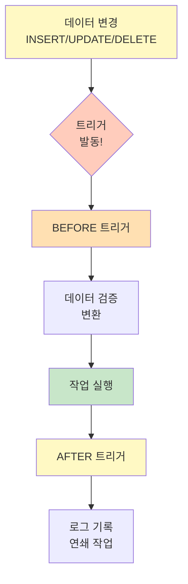

# Chapter 12: 트리거 (Trigger)

## 📖 수업 개요

이 장에서는 특정 사건이 발생했을 때 자동으로 실행되는 데이터베이스 객체인 트리거(Trigger)를 학습합니다. INSERT, UPDATE, DELETE 이전/이후에 자동으로 실행되는 트리거를 사용하여 데이터 무결성을 보장하고, 감사 로그를 자동으로 기록하며, 데이터 일관성을 유지하는 방법을 다룹니다. 트리거의 강력한 기능과 주의사항을 이해하는 것이 목표입니다.

---

## 📚 Part 1: 이론 학습

### 🌟 이 부분에서 배우는 것

- 트리거의 개념과 작동 원리
- BEFORE와 AFTER 트리거
- INSERT, UPDATE, DELETE 트리거
- NEW와 OLD 참조
- 트리거의 활용 사례
- 트리거의 성능 영향

---

### 12.1 트리거 (Trigger)의 개념

**트리거**는 특정 테이블의 INSERT, UPDATE, DELETE 작업이 발생했을 때 자동으로 실행되는 저장 프로시저입니다.

**특징:**

- 자동으로 실행 (명시적 호출 불필요)
- 데이터 무결성 보장
- 감시 및 감사 기능 수행
- 복잡한 비즈니스 규칙 구현

**사용 사례:**

- 감사 로그(Audit Log) 기록
- 데이터 검증
- 자동 계산
- 데이터 동기화

---

### 12.2 트리거 생성

**기본 문법:**

```sql
CREATE TRIGGER trigger_name
BEFORE/AFTER INSERT/UPDATE/DELETE ON table_name
FOR EACH ROW
BEGIN
  -- 트리거 본문
  trigger_statements;
END;
```

**시점:**

- **BEFORE**: 작업 전에 실행 (데이터 검증 및 변경)
- **AFTER**: 작업 후에 실행 (로그 기록, 연쇄 작업)

**작업:**

- **INSERT**: 새로운 행 삽입 시
- **UPDATE**: 행 수정 시
- **DELETE**: 행 삭제 시





---

### 12.3 NEW와 OLD 참조

**NEW와 OLD**는 트리거에서 행의 값에 접근합니다.

```sql
-- INSERT 트리거
NEW.column_name  -- 새로 삽입된 값

-- UPDATE 트리거
OLD.column_name  -- 수정 전 값
NEW.column_name  -- 수정 후 값

-- DELETE 트리거
OLD.column_name  -- 삭제된 값
```

**예시:**

```sql
CREATE TRIGGER salary_update_log
AFTER UPDATE ON employees
FOR EACH ROW
BEGIN
  IF NEW.salary != OLD.salary THEN
    INSERT INTO salary_history (emp_id, old_salary, new_salary, change_date)
    VALUES (NEW.employee_id, OLD.salary, NEW.salary, NOW());
  END IF;
END;
```

---

### 12.4 BEFORE 트리거

**BEFORE 트리거**는 데이터 검증과 변환에 사용됩니다.

**예시:**

```sql
CREATE TRIGGER validate_salary
BEFORE INSERT ON employees
FOR EACH ROW
BEGIN
  IF NEW.salary < 0 THEN
    SIGNAL SQLSTATE '45000'
    SET MESSAGE_TEXT = '급여는 음수일 수 없습니다';
  END IF;
  
  -- 데이터 변환
  SET NEW.hire_date = CURDATE();
END;
```

**특징:**

- 데이터 검증
- 데이터 자동 변환
- 거부 가능 (SIGNAL)

---

### 12.5 AFTER 트리거

**AFTER 트리거**는 로그 기록과 연쇄 작업에 사용됩니다.

**예시:**

```sql
CREATE TRIGGER log_employee_deletion
AFTER DELETE ON employees
FOR EACH ROW
BEGIN
  INSERT INTO employee_archive (employee_id, name, deleted_date)
  VALUES (OLD.employee_id, OLD.name, NOW());
END;
```

**특징:**

- 원본 데이터는 이미 변경됨
- 로그 및 감시 기능
- 연쇄 작업 수행

---

### 12.6 INSERT 트리거

**INSERT 트리거**는 새로운 데이터 삽입 시 실행됩니다.

**예시:**

```sql
CREATE TRIGGER generate_product_code
BEFORE INSERT ON products
FOR EACH ROW
BEGIN
  SET NEW.product_code = CONCAT(DATE_FORMAT(NOW(), '%Y%m'), 
                                LPAD(AUTO_INCREMENT(), 4, '0'));
END;
```

---

### 12.7 UPDATE 트리거

**UPDATE 트리거**는 데이터 수정 시 실행됩니다.

**예시:**

```sql
CREATE TRIGGER track_salary_changes
AFTER UPDATE ON employees
FOR EACH ROW
BEGIN
  IF NEW.salary != OLD.salary THEN
    INSERT INTO salary_changes (emp_id, old_salary, new_salary, change_date)
    VALUES (NEW.employee_id, OLD.salary, NEW.salary, NOW());
  END IF;
END;
```

---

### 12.8 DELETE 트리거

**DELETE 트리거**는 데이터 삭제 시 실행됩니다.

**예시:**

```sql
CREATE TRIGGER archive_deleted_employee
BEFORE DELETE ON employees
FOR EACH ROW
BEGIN
  INSERT INTO employee_archive (employee_id, name, salary, deleted_date)
  VALUES (OLD.employee_id, OLD.name, OLD.salary, NOW());
END;
```

---

### 12.9 트리거 조회 및 삭제

**트리거 조회:**

```sql
SHOW TRIGGERS;
SHOW TRIGGERS FROM database_name;
SHOW TRIGGERS LIKE 'pattern';
```

**트리거 정보:**

```sql
SELECT * FROM INFORMATION_SCHEMA.TRIGGERS
WHERE TRIGGER_SCHEMA = 'database_name';
```

**트리거 삭제:**

```sql
DROP TRIGGER trigger_name;
DROP TRIGGER IF EXISTS trigger_name;
DROP TRIGGER database_name.trigger_name;
```

---

### 12.10 트리거의 주의사항

**성능 영향:**

- 모든 INSERT/UPDATE/DELETE에 오버헤드 발생
- 여러 트리거가 연쇄되면 성능 저하

**복잡성:**

- 트리거 로직이 복잡하면 디버깅 어려움
- 예기치 않은 동작 가능 (연쇄 반응)

**호환성:**

- 데이터베이스 간 문법 차이
- 마이그레이션 시 주의 필요

**제약사항:**

- BEFORE INSERT 트리거에서는 NEW 값만 수정 가능
- 트리거 내에서 트리거 실행 불가능 (깊이 제한)

---

## 📚 Part 2: 샘플 데이터

### employees 테이블

```sql
CREATE TABLE employees (
    employee_id INT PRIMARY KEY AUTO_INCREMENT,
    name VARCHAR(50),
    salary DECIMAL(10, 2),
    hire_date DATE
);

INSERT INTO employees VALUES
(1, '김철수', 5000000, '2020-01-15'),
(2, '이영희', 4000000, '2020-06-20');
```

### salary_history 테이블 (감시용)

```sql
CREATE TABLE salary_history (
    history_id INT PRIMARY KEY AUTO_INCREMENT,
    emp_id INT,
    old_salary DECIMAL(10, 2),
    new_salary DECIMAL(10, 2),
    change_date DATETIME
);
```

### audit_log 테이블

```sql
CREATE TABLE audit_log (
    log_id INT PRIMARY KEY AUTO_INCREMENT,
    table_name VARCHAR(50),
    operation VARCHAR(10),
    record_id INT,
    old_value VARCHAR(255),
    new_value VARCHAR(255),
    change_date DATETIME
);
```

---

## 💻 Part 3: 실습

### 🌟 이 부분에서 배우는 것

- 다양한 형태의 트리거 작성
- 트리거 디버깅
- 감시 및 감사 기능 구현
- 성능 고려사항

---

### 12-1. 기본 INSERT 트리거

INSERT 시 자동으로 실행되는 트리거를 생성하세요.

```sql
CREATE TRIGGER log_new_employee
AFTER INSERT ON employees
FOR EACH ROW
BEGIN
  INSERT INTO employee_log (action, emp_id, emp_name, timestamp)
  VALUES ('INSERT', NEW.employee_id, NEW.name, NOW());
END;
```

---

### 12-2. INSERT BEFORE 트리거

삽입 전 데이터를 검증하는 트리거를 생성하세요.

```sql
CREATE TRIGGER validate_salary_before_insert
BEFORE INSERT ON employees
FOR EACH ROW
BEGIN
  IF NEW.salary < 0 THEN
    SIGNAL SQLSTATE '45000'
    SET MESSAGE_TEXT = 'Salary cannot be negative';
  END IF;
END;
```

---

### 12-3. INSERT AFTER 트리거

삽입 후 감사 로그를 기록하는 트리거를 생성하세요.

```sql
CREATE TRIGGER audit_new_employee
AFTER INSERT ON employees
FOR EACH ROW
BEGIN
  INSERT INTO audit_log (table_name, operation, old_value, new_value, changed_at)
  VALUES ('employees', 'INSERT', NULL, NEW.name, NOW());
END;
```

---

### 12-4. UPDATE 트리거

UPDATE 시 변경 사항을 추적하는 트리거를 생성하세요.

```sql
CREATE TRIGGER track_salary_update
AFTER UPDATE ON employees
FOR EACH ROW
BEGIN
  IF NEW.salary != OLD.salary THEN
    INSERT INTO salary_changes (emp_id, old_salary, new_salary, changed_date)
    VALUES (NEW.employee_id, OLD.salary, NEW.salary, NOW());
  END IF;
END;
```

---

### 12-5. UPDATE BEFORE 트리거

수정 전 데이터를 검증하는 트리거를 생성하세요.

```sql
CREATE TRIGGER validate_salary_update
BEFORE UPDATE ON employees
FOR EACH ROW
BEGIN
  IF NEW.salary > OLD.salary * 2 THEN
    SIGNAL SQLSTATE '45000'
    SET MESSAGE_TEXT = 'Salary increase too large';
  END IF;
  
  SET NEW.last_modified = NOW();
END;
```

---

### 12-6. UPDATE AFTER 트리거

수정 후 변경 기록을 저장하는 트리거를 생성하세요.

```sql
CREATE TRIGGER log_employee_update
AFTER UPDATE ON employees
FOR EACH ROW
BEGIN
  INSERT INTO update_history (emp_id, old_data, new_data, updated_at)
  VALUES (NEW.employee_id, 
          CONCAT('Dept:', OLD.dept_id, ' Sal:', OLD.salary),
          CONCAT('Dept:', NEW.dept_id, ' Sal:', NEW.salary),
          NOW());
END;
```

---

### 12-7. DELETE 트리거

삭제 시 데이터를 아카이브하는 트리거를 생성하세요.

```sql
CREATE TRIGGER archive_deleted_employee
BEFORE DELETE ON employees
FOR EACH ROW
BEGIN
  INSERT INTO employee_archive (employee_id, name, salary, deleted_date)
  VALUES (OLD.employee_id, OLD.name, OLD.salary, NOW());
END;
```

---

### 12-8. DELETE BEFORE 트리거

삭제 전 데이터를 검증하는 트리거를 생성하세요.

```sql
CREATE TRIGGER validate_delete
BEFORE DELETE ON employees
FOR EACH ROW
BEGIN
  IF (SELECT COUNT(*) FROM orders WHERE emp_id = OLD.employee_id) > 0 THEN
    SIGNAL SQLSTATE '45000'
    SET MESSAGE_TEXT = 'Cannot delete employee with active orders';
  END IF;
END;
```

---

### 12-9. DELETE AFTER 트리거

삭제 후 아카이브 테이블에 저장하는 트리거를 생성하세요.

```sql
CREATE TRIGGER log_deletion
AFTER DELETE ON employees
FOR EACH ROW
BEGIN
  INSERT INTO deletion_log (emp_id, emp_name, deleted_at)
  VALUES (OLD.employee_id, OLD.name, NOW());
END;
```

---

### 12-10. 조건부 트리거

특정 조건일 때만 실행되는 트리거를 생성하세요.

```sql
CREATE TRIGGER bonus_trigger
AFTER UPDATE ON employees
FOR EACH ROW
BEGIN
  IF NEW.salary > OLD.salary * 1.2 THEN
    INSERT INTO bonus_eligible VALUES (NEW.employee_id, NEW.salary * 0.1, NOW());
  END IF;
END;
```

---

### 12-11. 여러 작업의 트리거

INSERT, UPDATE, DELETE를 각각 처리하는 트리거들을 생성하세요.

```sql
CREATE TRIGGER emp_insert_log
AFTER INSERT ON employees FOR EACH ROW
INSERT INTO emp_changes VALUES ('INSERT', NEW.employee_id, NOW());

CREATE TRIGGER emp_update_log
AFTER UPDATE ON employees FOR EACH ROW
INSERT INTO emp_changes VALUES ('UPDATE', NEW.employee_id, NOW());

CREATE TRIGGER emp_delete_log
AFTER DELETE ON employees FOR EACH ROW
INSERT INTO emp_changes VALUES ('DELETE', OLD.employee_id, NOW());
```

---

### 12-12. NEW 값 사용

트리거에서 NEW를 사용하여 새로운 값에 접근하세요.

```sql
CREATE TRIGGER process_new_data
AFTER INSERT ON employees FOR EACH ROW
BEGIN
  IF NEW.salary > 5000000 THEN
    INSERT INTO premium_employees VALUES (NEW.employee_id, NEW.name, NEW.salary);
  END IF;
END;
```

---

### 12-13. OLD 값 사용

트리거에서 OLD를 사용하여 이전 값에 접근하세요.

```sql
CREATE TRIGGER track_old_values
AFTER UPDATE ON employees FOR EACH ROW
BEGIN
  IF OLD.dept_id != NEW.dept_id THEN
    INSERT INTO dept_changes VALUES (OLD.employee_id, OLD.dept_id, NEW.dept_id, NOW());
  END IF;
END;
```

---

### 12-14. NEW와 OLD 비교

수정 시 OLD와 NEW를 비교하여 변경을 감지하세요.

```sql
CREATE TRIGGER detect_changes
AFTER UPDATE ON employees FOR EACH ROW
BEGIN
  IF OLD.salary != NEW.salary OR OLD.dept_id != NEW.dept_id THEN
    INSERT INTO change_log (emp_id, change_details, changed_at)
    VALUES (NEW.employee_id,
            CONCAT('Old: ', OLD.salary, '-', OLD.dept_id,
                   ' New: ', NEW.salary, '-', NEW.dept_id),
            NOW());
  END IF;
END;
```

---

### 12-15. 데이터 검증 트리거

SIGNAL을 사용하여 오류를 발생시키세요.

```sql
CREATE TRIGGER validate_employee_data
BEFORE INSERT ON employees FOR EACH ROW
BEGIN
  IF CHAR_LENGTH(NEW.name) < 2 THEN
    SIGNAL SQLSTATE '45000'
    SET MESSAGE_TEXT = 'Employee name must be at least 2 characters';
  END IF;
  
  IF NEW.hire_date > CURDATE() THEN
    SIGNAL SQLSTATE '45000'
    SET MESSAGE_TEXT = 'Hire date cannot be in the future';
  END IF;
END;
```

---

### 12-16. 자동 계산 트리거

트리거로 자동으로 계산된 값을 저장하세요.

```sql
CREATE TRIGGER auto_calculate
BEFORE INSERT ON salary_records FOR EACH ROW
BEGIN
  SET NEW.gross_pay = NEW.base_salary + NEW.allowance;
  SET NEW.tax = NEW.gross_pay * 0.1;
  SET NEW.net_pay = NEW.gross_pay - NEW.tax;
END;
```

---

### 12-17. 감사 로그 트리거

모든 INSERT/UPDATE/DELETE를 로깅하는 트리거를 생성하세요.

```sql
CREATE TRIGGER full_audit_log
AFTER INSERT ON employees FOR EACH ROW
BEGIN
  INSERT INTO audit_trail (table_name, operation, record_id, data, audit_time)
  VALUES ('employees', 'INSERT', NEW.employee_id, 
          CONCAT(NEW.employee_id, '|', NEW.name, '|', NEW.salary), NOW());
END;
```

---

### 12-18. 동기화 트리거

다른 테이블을 자동으로 동기화하는 트리거를 생성하세요.

```sql
CREATE TRIGGER sync_employee_summary
AFTER INSERT ON employees FOR EACH ROW
BEGIN
  UPDATE dept_summary 
  SET emp_count = emp_count + 1
  WHERE dept_id = NEW.dept_id;
END;
```

---

### 12-19. 카운터 업데이트 트리거

행 추가/삭제 시 카운터를 자동 업데이트하세요.

```sql
CREATE TRIGGER update_emp_counter_insert
AFTER INSERT ON employees FOR EACH ROW
BEGIN
  UPDATE counter SET total_employees = total_employees + 1;
END;

CREATE TRIGGER update_emp_counter_delete
AFTER DELETE ON employees FOR EACH ROW
BEGIN
  UPDATE counter SET total_employees = total_employees - 1;
END;
```

---

### 12-20. 타임스탐프 트리거

수정 시간을 자동으로 기록하세요.

```sql
CREATE TRIGGER set_timestamp
BEFORE UPDATE on employees FOR EACH ROW
BEGIN
  SET NEW.last_modified = NOW();
END;
```

---

### 12-21. 중복 방지 트리거

중복 데이터 삽입을 방지하세요.

```sql
CREATE TRIGGER prevent_duplicate
BEFORE INSERT ON employees FOR EACH ROW
BEGIN
  IF EXISTS(SELECT 1 FROM employees WHERE name = NEW.name AND dept_id = NEW.dept_id) THEN
    SIGNAL SQLSTATE '45000'
    SET MESSAGE_TEXT = 'This employee already exists in this department';
  END IF;
END;
```

---

### 12-22. 외래키 무결성 트리거

외래키 무결성을 확인하는 트리거를 생성하세요.

```sql
CREATE TRIGGER check_dept_exists
BEFORE INSERT ON employees FOR EACH ROW
BEGIN
  IF NOT EXISTS(SELECT 1 FROM departments WHERE dept_id = NEW.dept_id) THEN
    SIGNAL SQLSTATE '45000'
    SET MESSAGE_TEXT = 'Invalid department ID';
  END IF;
END;
```

---

### 12-23. 범위 검증 트리거

값이 유효한 범위 내인지 확인하세요.

```sql
CREATE TRIGGER validate_range
BEFORE INSERT ON employees FOR EACH ROW
BEGIN
  IF NEW.salary < 2000000 OR NEW.salary > 10000000 THEN
    SIGNAL SQLSTATE '45000'
    SET MESSAGE_TEXT = 'Salary must be between 2000000 and 10000000';
  END IF;
END;
```

---

### 12-24. 포맷 변환 트리거

데이터를 자동으로 포맷 변환하세요.

```sql
CREATE TRIGGER format_conversion
BEFORE INSERT ON employees FOR EACH ROW
BEGIN
  SET NEW.name = UPPER(TRIM(NEW.name));
  SET NEW.hire_date = DATE(NEW.hire_date);
END;
```

---

### 12-25. 트리거 조회

생성된 트리거의 정보를 조회하세요.

```sql
SHOW TRIGGERS;
SHOW TRIGGERS FROM database_name;
SELECT * FROM INFORMATION_SCHEMA.TRIGGERS WHERE TRIGGER_SCHEMA = 'database_name';
```

---

### 12-26. 트리거 삭제

불필요한 트리거를 삭제하세요.

```sql
DROP TRIGGER IF EXISTS log_new_employee;
DROP TRIGGER IF EXISTS database_name.log_new_employee;
```

---

### 12-27-40. 실무 시나리오 트리거들

급여 관리, 직원 관리, 재고 추적 등의 종합적인 트리거 시스템:

```sql
-- 급여 기록 자동화
CREATE TRIGGER record_salary_change
AFTER UPDATE ON employees FOR EACH ROW
BEGIN
  IF OLD.salary != NEW.salary THEN
    INSERT INTO salary_audit (emp_id, old_sal, new_sal, changed_date)
    VALUES (NEW.employee_id, OLD.salary, NEW.salary, NOW());
  END IF;
END;

-- 직원 삭제 아카이브
CREATE TRIGGER archive_employee
BEFORE DELETE ON employees FOR EACH ROW
BEGIN
  INSERT INTO employee_archive (emp_id, name, dept_id, archived_date)
  VALUES (OLD.employee_id, OLD.name, OLD.dept_id, NOW());
END;

-- 재고 감소 자동화
CREATE TRIGGER decrease_stock
AFTER INSERT ON sales FOR EACH ROW
BEGIN
  UPDATE products SET stock = stock - NEW.quantity
  WHERE product_id = NEW.product_id;
END;

-- 부서 통계 자동 업데이트
CREATE TRIGGER update_dept_stats
AFTER INSERT ON employees FOR EACH ROW
BEGIN
  UPDATE dept_statistics 
  SET emp_count = (SELECT COUNT(*) FROM employees WHERE dept_id = NEW.dept_id),
      avg_salary = (SELECT AVG(salary) FROM employees WHERE dept_id = NEW.dept_id)
  WHERE dept_id = NEW.dept_id;
END;
```

---

## 📝 Part 4: 과제 안내

### 이론 과제

**1번 과제**: 트리거의 개념과 특징을 설명하세요. 트리거가 필요한 상황과 사용 사례를 5가지 이상 제시하세요.

**2번 과제**: BEFORE와 AFTER 트리거의 차이점을 설명하세요. 각각이 적합한 작업과 제약사항을 논의하세요.

**3번 과제**: NEW와 OLD 참조의 개념을 설명하고, INSERT, UPDATE, DELETE 트리거에서 각각 어떻게 사용되는지 서술하세요.

**4번 과제**: 트리거의 성능 영향과 주의사항을 분석하세요. 트리거 사용으로 인한 오버헤드를 최소화하는 방법을 제시하세요.

**5번 과제**: 감사 로그(Audit Log) 구현을 위한 트리거 설계를 제시하세요. 모든 데이터 변경을 추적하는 포괄적인 감시 시스템을 어떻게 구축할 것인지 설명하세요.

제출 형식: Word 또는 PDF 문서 (2-3페이지)

---

### 실습 과제

**1번 과제**: 다양한 형태의 트리거를 생성하세요:

- INSERT BEFORE 트리거로 데이터 검증
- UPDATE AFTER 트리거로 변경 기록
- DELETE BEFORE 트리거로 아카이브

**2번 과제**: 감시 및 감사 기능을 구현하세요:

- 감사 로그 테이블 생성
- 모든 INSERT/UPDATE/DELETE를 로깅하는 트리거
- 감사 로그를 조회하여 변경 이력 확인

**3번 과제**: 데이터 무결성을 보장하는 트리거를 작성하세요:

- 급여가 음수가 되지 않도록 검증
- 고용일이 미래 날짜가 되지 않도록 검증
- 중복 데이터 삽입 방지

**4번 과제**: 자동화 기능을 구현하세요:

- 직원 추가 시 로그인 ID 자동 생성
- 급여 수정 시 변경 기록 자동 저장
- 직원 삭제 시 정보 자동 아카이브

**5번 과제**: Part 3의 실습 12-1부터 12-40까지 제공된 모든 쿼리를 직접 실행하고, 각 결과를 스크린샷으로 첨부하세요. 추가로 5개 이상의 실무 시나리오(급여 관리, 직원 관리, 재고 추적 등)의 종합적인 트리거 시스템을 구축하여 그 결과를 제시하고, 각 트리거의 목적과 동작 방식을 설명하세요.

제출 형식: SQL 파일 (Ch12_Trigger_[학번].sql) 및 결과 스크린샷

---

수고했습니다.

조정현 교수(peterchokr@gmail.com). 영남이공대학교
