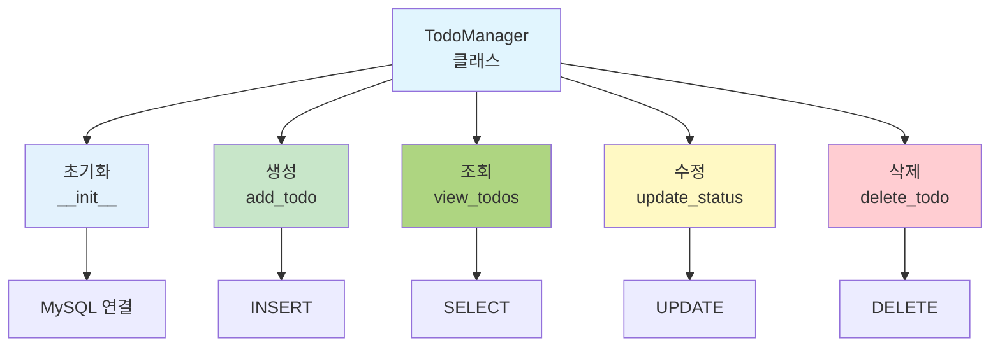

# 부록 1: 파이썬으로 배우는 데이터베이스 (MySQL)

## 📚 개요

이 부록에서는 파이썬으로 MySQL 데이터베이스를 직접 다루는 방법을 배웁니다.
MySQL 데이터베이스를 사용하여 간단한 **할일 관리(Todo Manager)** 애플리케이션을 만들어봅시다.

### 🎯 학습 목표

- 파이썬에서 MySQL 연결
- CREATE, INSERT, SELECT, UPDATE, DELETE 실행
- 데이터베이스 트랜잭션 관리
- 실제 애플리케이션 개발 경험

---

## 📖 Part 1: 파이썬과 MySQL 기초

### 1.1 MySQL이란?

```
MySQL은 강력하고 안정적인 관계형 데이터베이스
- 서버-클라이언트 방식 (별도의 MySQL 서버 필요)
- 파이썬 mysql.connector 모듈로 연결
- 실무와 학습에 최적
```

### 1.2 MySQL 설치 및 준비

```bash
# 1. MySQL 서버 설치
# Windows: https://dev.mysql.com/downloads/mysql/
# macOS: brew install mysql
# Linux: sudo apt-get install mysql-server

# 2. MySQL 서버 시작
# Windows: MySQL Shell 또는 Services에서 시작
# macOS/Linux: sudo systemctl start mysql

# 3. 파이썬 라이브러리 설치
pip install mysql-connector-python
```

### 1.3 MySQL 연결하기

```python
import mysql.connector

# MySQL 서버에 연결
conn = mysql.connector.connect(
    host="localhost",        # MySQL 서버 주소
    user="root",            # MySQL 사용자명
    password="password",    # MySQL 비밀번호
    database="python_db"    # 사용할 데이터베이스
)

# 커서 생성 (SQL 실행)
cursor = conn.cursor()

# 쿼리 실행
cursor.execute("SELECT VERSION()")
version = cursor.fetchone()
print(f"MySQL 버전: {version[0]}")

# 연결 종료
cursor.close()
conn.close()
```

### 1.4 데이터베이스 및 테이블 생성

```python
import mysql.connector

# MySQL 서버에 연결 (database 없이)
conn = mysql.connector.connect(
    host="localhost",
    user="root",
    password="password"
)

cursor = conn.cursor()

# 데이터베이스 생성
cursor.execute("CREATE DATABASE IF NOT EXISTS python_db CHARACTER SET utf8mb4")
print("✅ 데이터베이스 'python_db'가 생성되었습니다.")

# 데이터베이스 선택
cursor.execute("USE python_db")

# 테이블 생성
sql = '''
CREATE TABLE IF NOT EXISTS todos (
    id INT PRIMARY KEY AUTO_INCREMENT,
    title VARCHAR(200) NOT NULL,
    description TEXT,
    status VARCHAR(50) DEFAULT '미완료',
    created_date DATE
)
'''

cursor.execute(sql)
conn.commit()
print("✅ 테이블 'todos'가 생성되었습니다.")

cursor.close()
conn.close()
```

---

## 💻 Part 2: Todo Manager 애플리케이션

### 2.1 완전한 코드



```python
import mysql.connector
from datetime import datetime

class TodoManager:
    def __init__(self, host='localhost', user='root', password='password', database='python_db'):
        """MySQL 데이터베이스 연결"""
        try:
            self.conn = mysql.connector.connect(
                host=host,
                user=user,
                password=password,
                database=database
            )
            self.cursor = self.conn.cursor()
            self.create_table()
            print("✅ MySQL 데이터베이스에 연결되었습니다.")
        except mysql.connector.Error as err:
            if err.errno == 2003:
                print("❌ MySQL 서버에 연결할 수 없습니다. MySQL 서버를 시작하세요.")
            elif err.errno == 1045:
                print("❌ 사용자명 또는 비밀번호가 잘못되었습니다.")
            elif err.errno == 1049:
                print("❌ 데이터베이스를 찾을 수 없습니다.")
            else:
                print(f"❌ 연결 오류: {err}")
            raise

    def create_table(self):
        """테이블 생성"""
        sql = '''
        CREATE TABLE IF NOT EXISTS todos (
            id INT PRIMARY KEY AUTO_INCREMENT,
            title VARCHAR(200) NOT NULL,
            description TEXT,
            status VARCHAR(50) DEFAULT '미완료',
            created_date DATE
        )
        '''
        try:
            self.cursor.execute(sql)
            self.conn.commit()
        except mysql.connector.Error as err:
            print(f"❌ 테이블 생성 오류: {err}")

    def add_todo(self, title, description=''):
        """할일 추가"""
        sql = '''
        INSERT INTO todos (title, description, created_date)
        VALUES (%s, %s, %s)
        '''
        try:
            self.cursor.execute(sql, (title, description, datetime.now().date()))
            self.conn.commit()
            print(f"✅ '{title}' 할일이 추가되었습니다.")
        except mysql.connector.Error as err:
            print(f"❌ 오류: {err}")
            self.conn.rollback()

    def view_todos(self, status='전체'):
        """할일 조회"""
        try:
            if status == '전체':
                sql = 'SELECT id, title, description, status, created_date FROM todos'
                self.cursor.execute(sql)
            else:
                sql = 'SELECT id, title, description, status, created_date FROM todos WHERE status = %s'
                self.cursor.execute(sql, (status,))
            
            return self.cursor.fetchall()
        except mysql.connector.Error as err:
            print(f"❌ 오류: {err}")
            return []

    def update_status(self, todo_id, new_status):
        """할일 상태 변경"""
        sql = 'UPDATE todos SET status = %s WHERE id = %s'
        try:
            self.cursor.execute(sql, (new_status, todo_id))
            self.conn.commit()
            if self.cursor.rowcount > 0:
                print(f"✅ 할일 #{todo_id}이 '{new_status}'으로 변경되었습니다.")
            else:
                print(f"❌ 할일 #{todo_id}을 찾을 수 없습니다.")
        except mysql.connector.Error as err:
            print(f"❌ 오류: {err}")
            self.conn.rollback()

    def delete_todo(self, todo_id):
        """할일 삭제"""
        sql = 'DELETE FROM todos WHERE id = %s'
        try:
            self.cursor.execute(sql, (todo_id,))
            self.conn.commit()
            if self.cursor.rowcount > 0:
                print(f"✅ 할일 #{todo_id}이 삭제되었습니다.")
            else:
                print(f"❌ 할일 #{todo_id}을 찾을 수 없습니다.")
        except mysql.connector.Error as err:
            print(f"❌ 오류: {err}")
            self.conn.rollback()

    def close(self):
        """데이터베이스 연결 종료"""
        if self.cursor:
            self.cursor.close()
        if self.conn:
            self.conn.close()
        print("✅ 데이터베이스 연결이 종료되었습니다.")

# 사용 예제
if __name__ == '__main__':
    try:
        manager = TodoManager()
    
        # 1. 할일 추가
        manager.add_todo('파이썬 공부', '데이터베이스 챕터 완독')
        manager.add_todo('프로젝트 완성', 'Todo Manager 완성')
        manager.add_todo('운동하기', '헬스장 운동')
    
        # 2. 모든 할일 조회
        print("\n[모든 할일]")
        todos = manager.view_todos()
        for todo in todos:
            todo_id, title, desc, status, date = todo
            print(f"{todo_id}. {title} - {status}")
    
        # 3. 할일 상태 변경
        manager.update_status(1, '완료')
    
        # 4. 할일 삭제
        manager.delete_todo(3)
    
        # 5. 완료된 할일만 조회
        print("\n[완료된 할일]")
        completed = manager.view_todos('완료')
        for todo in completed:
            todo_id, title, desc, status, date = todo
            print(f"✓ {title}")
    
        manager.close()
    except Exception as e:
        print(f"프로그램 오류: {e}")
```

### 2.2 실행 결과

```
✅ MySQL 데이터베이스에 연결되었습니다.
✅ '파이썬 공부' 할일이 추가되었습니다.
✅ '프로젝트 완성' 할일이 추가되었습니다.
✅ '운동하기' 할일이 추가되었습니다.

[모든 할일]
1. 파이썬 공부 - 미완료
2. 프로젝트 완성 - 미완료
3. 운동하기 - 미완료

✅ 할일 #1이 '완료'으로 변경되었습니다.
✅ 할일 #3이 삭제되었습니다.

[완료된 할일]
✓ 파이썬 공부

✅ 데이터베이스 연결이 종료되었습니다.
```

---

## 📝 Part 3: 기본 SQL 명령어 (파이썬 MySQL 버전)

### 3.1 CREATE (생성)

```python
import mysql.connector

conn = mysql.connector.connect(
    host='localhost',
    user='root',
    password='password',
    database='python_db'
)
cursor = conn.cursor()

# 테이블 생성
sql = '''
CREATE TABLE IF NOT EXISTS users (
    id INT PRIMARY KEY AUTO_INCREMENT,
    name VARCHAR(100) NOT NULL,
    age INT,
    email VARCHAR(100) UNIQUE
)
'''
cursor.execute(sql)
conn.commit()
print("✅ 테이블 'users'가 생성되었습니다.")

cursor.close()
conn.close()
```

### 3.2 INSERT (삽입)

```python
# 1개 행 삽입
sql = 'INSERT INTO users (name, age, email) VALUES (%s, %s, %s)'
cursor.execute(sql, ('김철수', 25, 'kim@email.com'))

# 여러 행 삽입
data = [
    ('이영희', 23, 'lee@email.com'),
    ('박민준', 26, 'park@email.com'),
    ('최순신', 24, 'choi@email.com')
]
cursor.executemany(sql, data)

conn.commit()  # 저장
print(f"✅ {cursor.rowcount}개의 행이 삽입되었습니다.")
```

### 3.3 SELECT (조회)

```python
# 모든 행 조회
sql = 'SELECT * FROM users'
cursor.execute(sql)
results = cursor.fetchall()

for row in results:
    print(row)

# 조건부 조회
sql = 'SELECT * FROM users WHERE age > %s'
cursor.execute(sql, (25,))
results = cursor.fetchall()

# 첫 번째 행만 조회
cursor.execute(sql)
first = cursor.fetchone()
print(first)
```

### 3.4 UPDATE (수정)

```python
# 특정 사용자 나이 수정
sql = 'UPDATE users SET age = %s WHERE name = %s'
cursor.execute(sql, (26, '김철수'))
conn.commit()

print(f"✅ {cursor.rowcount}개의 행이 수정되었습니다.")
```

### 3.5 DELETE (삭제)

```python
# 특정 사용자 삭제
sql = 'DELETE FROM users WHERE age < %s'
cursor.execute(sql, (20,))
conn.commit()

print(f"✅ {cursor.rowcount}개의 행이 삭제되었습니다.")
```

---

## 🎓 Part 4: 고급 기능

### 4.1 트랜잭션 처리

```python
try:
    cursor.execute('INSERT INTO users (name, age, email) VALUES (%s, %s, %s)', 
                   ('신사임당', 28, 'shin@email.com'))
    cursor.execute('UPDATE users SET age = age + 1 WHERE age > %s', (25,))
    
    conn.commit()  # 모두 성공 시 저장
    print("✅ 트랜잭션이 성공적으로 완료되었습니다.")
except mysql.connector.Error as err:
    conn.rollback()  # 오류 시 취소
    print(f"❌ 트랜잭션 실패: {err}")
```

### 4.2 데이터 검증

```python
def add_user(cursor, conn, name, age, email):
    """입력 검증 후 사용자 추가"""
    # 입력 검증
    if not name or len(name) < 2:
        print("❌ 이름은 2글자 이상이어야 합니다.")
        return False
    
    if age < 0 or age > 150:
        print("❌ 나이는 0~150 사이여야 합니다.")
        return False
    
    if '@' not in email:
        print("❌ 유효한 이메일을 입력하세요.")
        return False
    
    # 데이터베이스 저장
    sql = 'INSERT INTO users (name, age, email) VALUES (%s, %s, %s)'
    try:
        cursor.execute(sql, (name, age, email))
        conn.commit()
        print(f"✅ {name}이 추가되었습니다.")
        return True
    except mysql.connector.Error as err:
        if err.errno == 1062:  # Duplicate entry
            print(f"❌ '{email}'은 이미 등록되어 있습니다.")
        else:
            print(f"❌ 오류: {err}")
        conn.rollback()
        return False

# 사용 예
add_user(cursor, conn, '이순신', 35, 'lee@email.com')
```

### 4.3 조인 쿼리

```python
# 먼저 테이블 생성
cursor.execute('''
CREATE TABLE IF NOT EXISTS students (
    id INT PRIMARY KEY AUTO_INCREMENT,
    name VARCHAR(100),
    grade INT
)
''')

cursor.execute('''
CREATE TABLE IF NOT EXISTS grades (
    id INT PRIMARY KEY AUTO_INCREMENT,
    student_id INT,
    subject VARCHAR(50),
    score INT,
    FOREIGN KEY (student_id) REFERENCES students(id)
)
''')

conn.commit()

# 샘플 데이터 삽입
students_data = [('김철수', 1), ('이영희', 1), ('박민준', 2)]
cursor.executemany('INSERT INTO students (name, grade) VALUES (%s, %s)', students_data)

grades_data = [
    (1, '수학', 95),
    (1, '영어', 87),
    (2, '수학', 92),
    (2, '영어', 90)
]
cursor.executemany('INSERT INTO grades (student_id, subject, score) VALUES (%s, %s, %s)', grades_data)
conn.commit()

# 조인 조회
sql = '''
SELECT s.name, g.subject, g.score
FROM students s
JOIN grades g ON s.id = g.student_id
WHERE s.grade = 1
ORDER BY s.name, g.subject
'''
cursor.execute(sql)
results = cursor.fetchall()

print("\n[1학년 학생 성적]")
for name, subject, score in results:
    print(f"{name}: {subject} {score}점")
```

---

## 💡 Part 5: 실습 예제

### 5.1 학생 성적 관리 시스템

```python
import mysql.connector

class StudentGradeManager:
    def __init__(self, host='localhost', user='root', password='password', database='python_db'):
        """MySQL 데이터베이스 연결"""
        try:
            self.conn = mysql.connector.connect(
                host=host,
                user=user,
                password=password,
                database=database
            )
            self.cursor = self.conn.cursor()
            self.setup()
            print("✅ 학생 성적 관리 시스템이 준비되었습니다.")
        except mysql.connector.Error as err:
            print(f"❌ 연결 오류: {err}")
            raise

    def setup(self):
        """테이블 생성"""
        # 학생 테이블
        self.cursor.execute('''
            CREATE TABLE IF NOT EXISTS students (
                id INT PRIMARY KEY AUTO_INCREMENT,
                name VARCHAR(100) NOT NULL UNIQUE
            )
        ''')
        
        # 성적 테이블
        self.cursor.execute('''
            CREATE TABLE IF NOT EXISTS grades (
                id INT PRIMARY KEY AUTO_INCREMENT,
                student_id INT,
                subject VARCHAR(50),
                score INT,
                FOREIGN KEY (student_id) REFERENCES students(id)
            )
        ''')
        self.conn.commit()

    def add_student(self, name):
        """학생 추가"""
        sql = 'INSERT INTO students (name) VALUES (%s)'
        try:
            self.cursor.execute(sql, (name,))
            self.conn.commit()
            print(f"✅ {name}이 추가되었습니다.")
        except mysql.connector.Error as err:
            if err.errno == 1062:
                print(f"❌ {name}은 이미 존재합니다.")
            else:
                print(f"❌ 오류: {err}")
            self.conn.rollback()

    def add_grade(self, student_name, subject, score):
        """성적 추가"""
        # 학생 ID 찾기
        self.cursor.execute('SELECT id FROM students WHERE name = %s', (student_name,))
        result = self.cursor.fetchone()
        
        if not result:
            print(f"❌ {student_name}을 찾을 수 없습니다.")
            return
        
        student_id = result[0]
        sql = 'INSERT INTO grades (student_id, subject, score) VALUES (%s, %s, %s)'
        try:
            self.cursor.execute(sql, (student_id, subject, score))
            self.conn.commit()
            print(f"✅ {student_name}의 {subject} 성적({score}점)이 추가되었습니다.")
        except mysql.connector.Error as err:
            print(f"❌ 오류: {err}")
            self.conn.rollback()

    def get_average(self, student_name):
        """평균 성적 조회"""
        sql = '''
        SELECT AVG(g.score)
        FROM students s
        JOIN grades g ON s.id = g.student_id
        WHERE s.name = %s
        '''
        self.cursor.execute(sql, (student_name,))
        result = self.cursor.fetchone()
        return result[0] if result[0] else 0

    def print_report(self):
        """성적 보고서 출력"""
        sql = '''
        SELECT s.name, g.subject, g.score
        FROM students s
        JOIN grades g ON s.id = g.student_id
        ORDER BY s.name, g.subject
        '''
        self.cursor.execute(sql)
        
        print("\n📊 성적 보고서")
        print("-" * 40)
        
        current_student = None
        for name, subject, score in self.cursor.fetchall():
            if name != current_student:
                if current_student:
                    avg = self.get_average(current_student)
                    print(f"평균: {avg:.1f}\n")
                print(f"\n{name}:")
                current_student = name
            
            print(f"  {subject}: {score}점")
        
        # 마지막 학생 평균
        if current_student:
            avg = self.get_average(current_student)
            print(f"평균: {avg:.1f}")

    def close(self):
        """연결 종료"""
        if self.cursor:
            self.cursor.close()
        if self.conn:
            self.conn.close()

# 사용 예
if __name__ == '__main__':
    try:
        manager = StudentGradeManager()
        
        # 학생 추가
        manager.add_student('김철수')
        manager.add_student('이영희')
        manager.add_student('박민준')
        
        # 성적 추가
        manager.add_grade('김철수', '수학', 95)
        manager.add_grade('김철수', '영어', 87)
        manager.add_grade('이영희', '수학', 92)
        manager.add_grade('이영희', '영어', 90)
        manager.add_grade('박민준', '수학', 88)
        manager.add_grade('박민준', '영어', 85)
        
        # 성적 보고서 출력
        manager.print_report()
        
        manager.close()
    except Exception as e:
        print(f"프로그램 오류: {e}")
```

---

## 🔍 Part 6: 일반적인 오류와 해결

### 6.1 MySQL 연결 오류

```python
import mysql.connector

try:
    conn = mysql.connector.connect(
        host='localhost',
        user='root',
        password='password',
        database='python_db'
    )
except mysql.connector.Error as err:
    if err.errno == 2003:
        print("❌ MySQL 서버에 연결할 수 없습니다.")
        print("   1. MySQL 서버가 실행 중인지 확인하세요.")
        print("   2. 호스트, 사용자명, 비밀번호를 확인하세요.")
    elif err.errno == 1045:
        print("❌ 사용자명 또는 비밀번호가 잘못되었습니다.")
    elif err.errno == 1049:
        print("❌ 데이터베이스를 찾을 수 없습니다.")
    else:
        print(f"❌ 오류: {err}")
```

### 6.2 SQL 오류 처리

```python
import mysql.connector

try:
    cursor.execute('SELECT * FROM nonexistent_table')
except mysql.connector.Error as err:
    if err.errno == 1054:
        print("❌ 테이블이 존재하지 않습니다.")
    else:
        print(f"❌ SQL 오류: {err}")

try:
    cursor.execute('INSERT INTO users (name, age) VALUES (%s, %s)', ('김철수',))
    # 값이 1개인데 2개 필요
except mysql.connector.Error as err:
    if err.errno == 1054:
        print("❌ 칼럼 수가 맞지 않습니다.")
    else:
        print(f"❌ 오류: {err}")
```

### 6.3 SQL 인젝션 방지

```python
# ❌ SQL 인젝션 위험 (절대 사용 금지!)
name = "'; DROP TABLE users; --"
sql = f"SELECT * FROM users WHERE name = '{name}'"
cursor.execute(sql)

# ✅ 안전한 방법 (항상 이 방법 사용!)
sql = "SELECT * FROM users WHERE name = %s"
cursor.execute(sql, (name,))
```

### 6.4 중요한 주의사항

```python
# MySQL은 파라미터 바인딩에 %s 사용 (SQLite의 ?가 아님!)

# ❌ SQLite 방식 (MySQL에서는 작동 안 함)
cursor.execute("SELECT * FROM users WHERE name = ?", (name,))

# ✅ MySQL 방식 (올바른 방법)
cursor.execute("SELECT * FROM users WHERE name = %s", (name,))

# 중요: VALUES도 %s 사용
# ❌ 잘못된 방법
cursor.execute("INSERT INTO users VALUES (?, ?, ?)", data)

# ✅ 올바른 방법
cursor.execute("INSERT INTO users VALUES (%s, %s, %s)", data)
```

---

## 📚 Part 7: 주요 함수 정리

| 함수 | 설명 |
|:----:|:---|
| `mysql.connector.connect()` | MySQL 서버에 연결 |
| `cursor.execute()` | SQL 한 개 실행 |
| `cursor.executemany()` | SQL 여러 개 실행 |
| `cursor.fetchone()` | 첫 번째 행 반환 |
| `cursor.fetchall()` | 모든 행 반환 |
| `cursor.rowcount` | 영향을 받은 행 수 |
| `conn.commit()` | 변경사항 저장 |
| `conn.rollback()` | 변경사항 취소 |
| `cursor.close()` | 커서 종료 |
| `conn.close()` | 연결 종료 |

---

## 🎯 연습 문제

### 1. 기본 CRUD 구현

전화번호부 애플리케이션을 MySQL로 만드시오.

- 연락처 추가 (이름, 전화번호, 이메일)
- 연락처 조회
- 연락처 수정
- 연락처 삭제
- 이름으로 검색

### 2. 데이터 분석

학생 성적 데이터로부터:

- 과목별 평균 점수
- 최고 점수와 최저 점수
- 90점 이상 학생 명단
- 학생별 평균 성적

### 3. 고급 기능

- 검색 기능 추가 (이름, 과목으로 검색)
- 정렬 기능 (이름순, 점수순)
- 데이터 백업 기능
- 엑셀 파일로 내보내기

---

## ⚙️ 추가: MySQL 설정 팁

### 1. MySQL 사용자 생성

```sql
-- MySQL 관리자로 로그인 후
CREATE USER 'python_user'@'localhost' IDENTIFIED BY 'password123';
GRANT ALL PRIVILEGES ON python_db.* TO 'python_user'@'localhost';
FLUSH PRIVILEGES;
```

### 2. Python 연결 설정

```python
conn = mysql.connector.connect(
    host='localhost',
    user='python_user',  # 새로 생성한 사용자
    password='password123',
    database='python_db'
)
```

### 3. MySQL 명령줄 접속

```bash
# MySQL 접속
mysql -u root -p

# 또는 다른 사용자로
mysql -u python_user -p

# 데이터베이스 선택
USE python_db;

# 테이블 확인
SHOW TABLES;
```

---

조정현 교수 (peterchokr@gmail.com)
