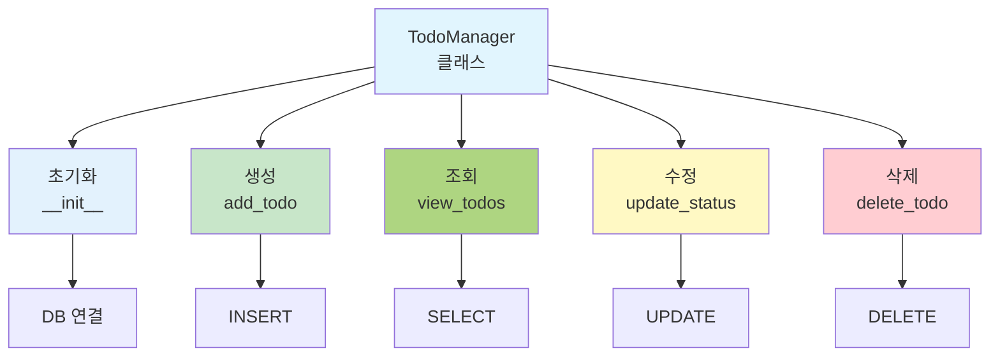

# 부록 1: 파이썬으로 배우는 데이터베이스

## 📚 개요

이 부록에서는 파이썬으로 데이터베이스를 직접 다루는 방법을 배웁니다.
SQLite 데이터베이스를 사용하여 간단한 **할일 관리(Todo Manager)** 애플리케이션을 만들어봅시다.

### 🎯 학습 목표

- 파이썬에서 SQLite 연결
- CREATE, INSERT, SELECT, UPDATE, DELETE 실행
- 데이터베이스 트랜잭션 관리
- 실제 애플리케이션 개발 경험

---

## 📖 Part 1: 파이썬과 SQLite 기초

### 1.1 SQLite란?

```
SQLite는 가볍고 간단한 데이터베이스
- 파일 기반 (서버 불필요)
- 파이썬에 기본 내장 (sqlite3 모듈)
- 초기 학습에 최적
```

### 1.2 SQLite 연결하기

```python
import sqlite3

# 데이터베이스 파일 생성/연결
conn = sqlite3.connect('todo.db')

# 커서 생성 (SQL 실행)
cursor = conn.cursor()

# 데이터베이스 종료
conn.close()
```

### 1.3 테이블 생성

```python
import sqlite3

conn = sqlite3.connect('todo.db')
cursor = conn.cursor()

# 테이블 생성
sql = '''
CREATE TABLE IF NOT EXISTS todos (
    id INTEGER PRIMARY KEY AUTOINCREMENT,
    title TEXT NOT NULL,
    description TEXT,
    status TEXT DEFAULT '미완료',
    created_date DATE
)
'''

cursor.execute(sql)
conn.commit()  # 변경사항 저장
conn.close()
```

---

## 💻 Part 2: Todo Manager 애플리케이션

### 2.1 완전한 코드



```python
import sqlite3
from datetime import datetime

class TodoManager:
    def __init__(self, db_name='todo.db'):
        self.conn = sqlite3.connect(db_name)
        self.cursor = self.conn.cursor()
        self.create_table()
  
    def create_table(self):
        '''테이블 생성'''
        sql = '''
        CREATE TABLE IF NOT EXISTS todos (
            id INTEGER PRIMARY KEY AUTOINCREMENT,
            title TEXT NOT NULL,
            description TEXT,
            status TEXT DEFAULT '미완료',
            created_date TEXT
        )
        '''
        self.cursor.execute(sql)
        self.conn.commit()
  
    def add_todo(self, title, description=''):
        '''할일 추가'''
        sql = '''
        INSERT INTO todos (title, description, created_date)
        VALUES (?, ?, ?)
        '''
        self.cursor.execute(sql, (title, description, datetime.now().date()))
        self.conn.commit()
        print(f"✅ '{title}' 할일이 추가되었습니다.")
  
    def view_todos(self, status='전체'):
        '''할일 조회'''
        if status == '전체':
            sql = 'SELECT * FROM todos'
        else:
            sql = 'SELECT * FROM todos WHERE status = ?'
            return self.cursor.execute(sql, (status,)).fetchall()
    
        return self.cursor.execute(sql).fetchall()
  
    def update_status(self, todo_id, new_status):
        '''할일 상태 변경'''
        sql = 'UPDATE todos SET status = ? WHERE id = ?'
        self.cursor.execute(sql, (new_status, todo_id))
        self.conn.commit()
        print(f"✅ 할일 #{todo_id}이 '{new_status}'으로 변경되었습니다.")
  
    def delete_todo(self, todo_id):
        '''할일 삭제'''
        sql = 'DELETE FROM todos WHERE id = ?'
        self.cursor.execute(sql, (todo_id,))
        self.conn.commit()
        print(f"✅ 할일 #{todo_id}이 삭제되었습니다.")
  
    def close(self):
        '''데이터베이스 종료'''
        self.conn.close()

# 사용 예제
if __name__ == '__main__':
    manager = TodoManager()
  
    # 1. 할일 추가
    manager.add_todo('파이썬 공부', '데이터베이스 챕터 완독')
    manager.add_todo('프로젝트 완성', 'Todo Manager 완성')
    manager.add_todo('운동하기', '헬스장 운동')
  
    # 2. 모든 할일 조회
    print("\n[모든 할일]")
    todos = manager.view_todos()
    for todo in todos:
        print(f"{todo[0]}. {todo[1]} - {todo[3]}")
  
    # 3. 할일 상태 변경
    manager.update_status(1, '완료')
  
    # 4. 할일 삭제
    manager.delete_todo(3)
  
    # 5. 완료된 할일만 조회
    print("\n[완료된 할일]")
    completed = manager.view_todos('완료')
    for todo in completed:
        print(f"✓ {todo[1]}")
  
    manager.close()
```

### 2.2 실행 결과

```
✅ '파이썬 공부' 할일이 추가되었습니다.
✅ '프로젝트 완성' 할일이 추가되었습니다.
✅ '운동하기' 할일이 추가되었습니다.

[모든 할일]
1. 파이썬 공부 - 미완료
2. 프로젝트 완성 - 미완료
3. 운동하기 - 미완료

✅ 할일 #1이 '완료'으로 변경되었습니다.
✅ 할일 #3이 삭제되었습니다.

[완료된 할일]
✓ 파이썬 공부
```

---

## 📝 Part 3: 기본 SQL 명령어 (파이썬 버전)

### 3.1 CREATE (생성)

```python
# 테이블 생성
sql = '''
CREATE TABLE users (
    id INTEGER PRIMARY KEY,
    name TEXT NOT NULL,
    age INTEGER,
    email TEXT UNIQUE
)
'''
cursor.execute(sql)
```

### 3.2 INSERT (삽입)

```python
# 1개 행 삽입
sql = 'INSERT INTO users (name, age, email) VALUES (?, ?, ?)'
cursor.execute(sql, ('김철수', 25, 'kim@email.com'))

# 여러 행 삽입
data = [
    ('이영희', 23, 'lee@email.com'),
    ('박민준', 26, 'park@email.com')
]
cursor.executemany(sql, data)

conn.commit()  # 저장
```

### 3.3 SELECT (조회)

```python
# 모든 행 조회
sql = 'SELECT * FROM users'
cursor.execute(sql)
results = cursor.fetchall()

# 조건부 조회
sql = 'SELECT * FROM users WHERE age > ?'
cursor.execute(sql, (25,))
results = cursor.fetchall()

# 첫 번째 행만 조회
cursor.execute(sql)
first = cursor.fetchone()
```

### 3.4 UPDATE (수정)

```python
# 특정 사용자 나이 수정
sql = 'UPDATE users SET age = ? WHERE name = ?'
cursor.execute(sql, (26, '김철수'))
conn.commit()

print(f"수정된 행: {cursor.rowcount}개")
```

### 3.5 DELETE (삭제)

```python
# 특정 사용자 삭제
sql = 'DELETE FROM users WHERE age < ?'
cursor.execute(sql, (20,))
conn.commit()

print(f"삭제된 행: {cursor.rowcount}개")
```

---

## 🎓 Part 4: 고급 기능

### 4.1 트랜잭션 처리

```python
try:
    cursor.execute('INSERT INTO users VALUES (?, ?, ?)', ...)
    cursor.execute('UPDATE accounts SET balance = ? WHERE id = ?', ...)
    conn.commit()  # 모두 성공 시 저장
    print("트랜잭션 성공")
except Exception as e:
    conn.rollback()  # 오류 시 취소
    print(f"오류 발생: {e}")
```

### 4.2 데이터 검증

```python
def add_user(name, age, email):
    # 입력 검증
    if not name or len(name) < 2:
        print("❌ 이름은 2글자 이상이어야 합니다.")
        return False
  
    if age < 0 or age > 150:
        print("❌ 나이는 0~150 사이여야 합니다.")
        return False
  
    if '@' not in email:
        print("❌ 유효한 이메일을 입력하세요.")
        return False
  
    # 데이터베이스 저장
    sql = 'INSERT INTO users (name, age, email) VALUES (?, ?, ?)'
    try:
        cursor.execute(sql, (name, age, email))
        conn.commit()
        print(f"✅ {name}이 추가되었습니다.")
        return True
    except sqlite3.IntegrityError:
        print(f"❌ '{email}'은 이미 등록되어 있습니다.")
        return False
```

### 4.3 조인 쿼리

```python
# 학생 테이블
CREATE TABLE students (
    id INTEGER PRIMARY KEY,
    name TEXT,
    grade INTEGER
);

# 성적 테이블
CREATE TABLE grades (
    student_id INTEGER,
    subject TEXT,
    score INTEGER,
    FOREIGN KEY (student_id) REFERENCES students(id)
);

# 조인 조회
sql = '''
SELECT s.name, g.subject, g.score
FROM students s
JOIN grades g ON s.id = g.student_id
WHERE s.grade = 1
'''
cursor.execute(sql)
results = cursor.fetchall()

for name, subject, score in results:
    print(f"{name}: {subject} {score}점")
```

---

## 💡 Part 5: 실습 예제

### 5.1 학생 성적 관리 시스템

```python
class StudentGradeManager:
    def __init__(self):
        self.conn = sqlite3.connect('grades.db')
        self.cursor = self.conn.cursor()
        self.setup()
  
    def setup(self):
        '''테이블 생성'''
        self.cursor.execute('''
            CREATE TABLE IF NOT EXISTS students (
                id INTEGER PRIMARY KEY,
                name TEXT NOT NULL UNIQUE
            )
        ''')
    
        self.cursor.execute('''
            CREATE TABLE IF NOT EXISTS grades (
                id INTEGER PRIMARY KEY,
                student_id INTEGER,
                subject TEXT,
                score INTEGER,
                FOREIGN KEY (student_id) REFERENCES students(id)
            )
        ''')
        self.conn.commit()
  
    def add_student(self, name):
        '''학생 추가'''
        try:
            self.cursor.execute('INSERT INTO students (name) VALUES (?)', (name,))
            self.conn.commit()
            print(f"✅ {name}이 추가되었습니다.")
        except sqlite3.IntegrityError:
            print(f"❌ {name}은 이미 존재합니다.")
  
    def add_grade(self, student_name, subject, score):
        '''성적 추가'''
        # 학생 ID 찾기
        self.cursor.execute('SELECT id FROM students WHERE name = ?', (student_name,))
        result = self.cursor.fetchone()
    
        if not result:
            print(f"❌ {student_name}을 찾을 수 없습니다.")
            return
    
        student_id = result[0]
        self.cursor.execute(
            'INSERT INTO grades (student_id, subject, score) VALUES (?, ?, ?)',
            (student_id, subject, score)
        )
        self.conn.commit()
        print(f"✅ {student_name}의 {subject} 성적({score}점)이 추가되었습니다.")
  
    def get_average(self, student_name):
        '''평균 성적 조회'''
        sql = '''
        SELECT AVG(g.score)
        FROM students s
        JOIN grades g ON s.id = g.student_id
        WHERE s.name = ?
        '''
        self.cursor.execute(sql, (student_name,))
        result = self.cursor.fetchone()
        return result[0] if result[0] else 0
  
    def print_report(self):
        '''성적 보고서 출력'''
        sql = '''
        SELECT s.name, g.subject, g.score
        FROM students s
        JOIN grades g ON s.id = g.student_id
        ORDER BY s.name, g.subject
        '''
        self.cursor.execute(sql)
    
        print("\n📊 성적 보고서")
        print("-" * 40)
    
        current_student = None
        for name, subject, score in self.cursor.fetchall():
            if name != current_student:
                if current_student:
                    avg = self.get_average(current_student)
                    print(f"평균: {avg:.1f}\n")
                print(f"\n{name}:")
                current_student = name
        
            print(f"  {subject}: {score}점")

# 사용
manager = StudentGradeManager()
manager.add_student('김철수')
manager.add_student('이영희')
manager.add_grade('김철수', '수학', 95)
manager.add_grade('김철수', '영어', 87)
manager.add_grade('이영희', '수학', 92)
manager.add_grade('이영희', '영어', 90)

manager.print_report()
```

---

## 🔍 Part 6: 일반적인 오류와 해결

### 6.1 오류 처리

```python
try:
    cursor.execute('SELECT * FROM nonexistent_table')
except sqlite3.OperationalError:
    print("❌ 테이블이 존재하지 않습니다.")

try:
    cursor.execute('INSERT INTO users VALUES (?, ?, ?)', ('김철수', 25))
    # 값이 2개인데 3개 필요
except sqlite3.ProgrammingError:
    print("❌ SQL 문법이 잘못되었습니다.")
```

### 6.2 주의사항

```python
# ❌ SQL 인젝션 위험 (사용 금지)
name = "'; DROP TABLE users; --"
sql = f"SELECT * FROM users WHERE name = '{name}'"

# ✅ 안전한 방법 (사용)
sql = "SELECT * FROM users WHERE name = ?"
cursor.execute(sql, (name,))
```

---

## 📚 Part 7: 주요 함수 정리

|           함수           | 설명              |
| :----------------------: | :---------------- |
|  `sqlite3.connect()`  | 데이터베이스 연결 |
|   `cursor.execute()`   | SQL 한 개 실행    |
| `cursor.executemany()` | SQL 여러 개 실행  |
|  `cursor.fetchone()`  | 첫 번째 행 반환   |
|  `cursor.fetchall()`  | 모든 행 반환      |
|    `conn.commit()`    | 변경사항 저장     |
|   `conn.rollback()`   | 변경사항 취소     |
|     `conn.close()`     | 연결 종료         |
|   `cursor.rowcount`   | 영향을 받은 행 수 |

---

## 🎯 연습 문제

### 1. 기본 CRUD 구현

전화번호부 애플리케이션을 만드시오.

- 연락처 추가 (이름, 전화번호)
- 연락처 조회
- 연락처 수정
- 연락처 삭제

### 2. 데이터 분석

학생 성적 데이터로부터:

- 과목별 평균 점수
- 최고 점수와 최저 점수
- 90점 이상 학생 명단

### 3. 고급 기능

- 검색 기능 추가
- 정렬 기능 (이름순, 점수순)
- 데이터 백업 기능

---

수고했습니다.   
조정현 교수([peterchokr@gmail.com](mailto:peterchokr@gmail.com)) 영남이공대학교

이 수업자료는 Claude와 Gemini를 이용하여 제작되었습니다.
